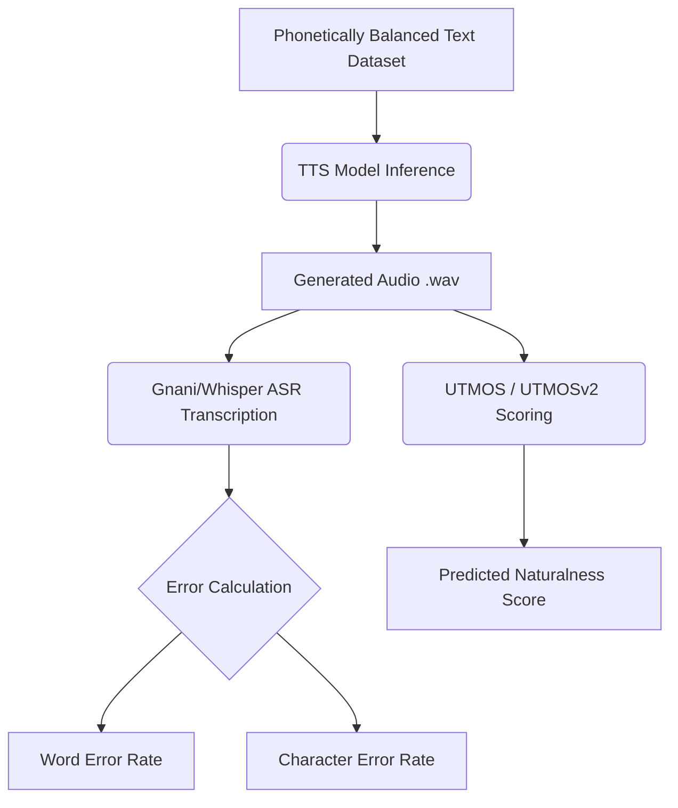

# Indian TTS Models — Benchmarking Standards
### A Comparative Evaluation of Text-to-Speech Synthesis for Indian Languages

**Repository:** [github.com/JayGang07/Indian-TTS-models](https://github.com/JayGang07/Indian-TTS-models)
**Conducted as part of an internship at Kaliber.AI / Bay Area Advanced Analytics**

---

## 1. Executive Summary

This report benchmarks **19 open-source and API-based Text-to-Speech (TTS) models** across **six Indian languages** — Hindi, Bengali, Assamese, Nepali, Urdu, and Maithili — with the goal of establishing a standardized, reproducible evaluation framework for Indic speech synthesis. Models are compared across naturalness, intelligibility, prosody, and voice-cloning fidelity, using a combination of automated ASR-based metrics (WER, CER), acoustic-similarity metrics (MCD, Log-F0 RMSE, Cosine Similarity), and human-rated Mean Opinion Score (MOS).

Key outcomes:
- **Kokoro** led the Hindi leaderboard (WER 0.359, MOS 4.60), the best overall balance of intelligibility and human-rated quality.
- **Indic F5** topped both the Bengali (WER 0.185) and Assamese (WER 0.302) leaderboards.
- **Meta MMS** was the strongest performer for Urdu (WER 0.373) and Maithili (WER 0.831), reflecting its broad multilingual coverage.
- **Nepali** remained the weakest-supported language across the board, with only four models producing usable output.
- **XTTS v2** demonstrated the strongest voice-cloning fidelity, achieving a speaker-embedding cosine similarity of 0.9481.

---

## 2. Project Overview and Objectives

Indian languages are dramatically underserved in mainstream TTS research relative to their speaker populations, and existing evaluations rarely apply a consistent methodology across models or languages. This project addresses that gap with the following objectives:

- Survey and catalog available TTS models supporting Indian languages.
- Define a reproducible benchmarking methodology for Indian-language TTS.
- Compare models across naturalness, intelligibility, accent accuracy, and multi-speaker support.
- Produce sample audio outputs for side-by-side subjective evaluation.
- Provide ready-to-run Google Colab notebooks for every model tested.

---

## 3. Models Evaluated

Nineteen models were benchmarked, spanning research releases, community fine-tunes, and commercial APIs.

| # | Model | Source | Architecture | Year | Params | Voice Cloning |
|:-:|-------|--------|--------------|:----:|:------:|:-------------:|
| 1 | XTTS v2 | Coqui TTS | Auto-regressive Transformer | 2023 | 518M | Yes |
| 2 | Meta MMS | Meta Research | VITS-based | 2023 | 300M | No |
| 3 | Suno Bark | Suno AI | Transformer Text-to-Audio | 2023 | 550M | No |
| 4 | VITS Rasa 13 | AI4Bharat | VITS (adversarial) | 2024 | 40.2M | No |
| 5 | Indic Parler-TTS | AI4Bharat | Encoder-Decoder Transformer | 2024 | 938M | No |
| 6 | Kokoro | Hexgrad | StyleTTS-based | 2024 | 82M | No |
| 7 | Kokoclone | Community | StyleTTS-based | 2025 | 82M | Yes |
| 8 | Spark-TTS | Spark-TTS | Qwen2.5 LLM + BiCodec | 2025 | 500M | Yes |
| 9 | Indic F5 | AI4Bharat | Flow-matching (F5-TTS) | 2025 | ~300M | Yes |
| 10 | Sarvam AI (Bulbul v3) | Sarvam AI | LLM-based TTS (API) | 2025 | N/A | No |
| 11 | CosyVoice 3 | Alibaba | Flow Matching Transformer | 2024 | ~1B | Yes |
| 12 | Xobdo Boroxa | Community | — | 2024 | — | — |
| 13 | Vachana TTS (Gnani) | Gnani.ai | Proprietary | 2024 | — | No |
| 14 | TuskByte-v1 | TuskByte | VITS-based | 2024 | — | No |
| 15 | Oshara (XTTS v2 Nepali) | Oshara | Auto-regressive (fine-tuned) | 2025 | 518M | Yes |
| 16 | FastSpeech 2 (Piper/ESPnet) | SMTIITM / Ampixa | FastSpeech 2 / VITS | 2024 | ~40M | No |
| 17 | Sooktam2 (F5-TTS) | AI4Bharat | Flow-matching (F5-TTS) | 2025 | ~300M | Yes |
| 18 | Sonic v3 | Cartesia | LLM-based TTS (API) | 2025 | N/A | No |
| 19 | Syspin VITS | SYSPIN | VITS (Coqui TTS) | 2024 | ~40M | No |

**Language coverage:** Indic Parler-TTS is the only model supporting all six target languages. Meta MMS covers five (all but Nepali). Coverage thins sharply for Nepali (4 models) and Maithili (3 models), reflecting the broader scarcity of training data for these languages.

---

## 4. Datasets

### 4.1 Voice-cloning reference datasets

| Dataset | Hours | Languages | Speakers |
|---------|-------|-----------|----------|
| Rasa | 400 | 13 | 20 |
| IndicVoices | 7,200 | 22 | 16,237 |
| GLOBE | 535 | English | 164 global accents |
| IndicVoices_R | 1,700 | 22 | 10,496 |
| SPICOR | 154 | Indian English, Gujarati | 4 |

### 4.2 Phonetically balanced evaluation sets

Rather than testing on random conversational sentences, this project constructs **custom phonetically balanced datasets** for each of the six languages — 20 sentences per language, deliberately engineered so that rare, hard-to-render phonemes (nukta consonants, aspirated stops, conjuncts, nasalization) appear at guaranteed, representative frequencies rather than being left to chance.

For Hindi, this means the schwa (अ) naturally dominates (250 occurrences, since every Devanagari consonant inherently carries it), long-vowel modifiers appear 170 times to test pitch/tone sustain, and "long-tail" nukta sounds — ज़, फ़, क़, ख़, ग़ — are forced to appear even though they'd almost never show up in a random sample of conversational text. The same design logic — targeting conjuncts, gemination, nasalization, retroflexes, and loanword fricatives — was applied to build the Bengali, Assamese, Nepali, Urdu, and Maithili sets.

---

## 5. Evaluation Methodology

### 5.1 Subjective metrics (human evaluation)
- **MOS (Mean Opinion Score):** 1–5 naturalness/quality rating.
- **CMOS:** Direct side-by-side comparison of two samples.
- **ABX Testing:** Listener matches sample A or B to reference X; used mainly for voice-cloning fidelity.

### 5.2 Objective metrics (automated evaluation)
- **WER / CER:** Word- and character-level transcription accuracy via ASR.
- **STOI:** Acoustic-feature-based intelligibility score.
- **PESQ:** Predicts subjective quality from signal-level features.

### 5.3 Voice-cloning fidelity metrics
- **Log-F0 RMSE** — pitch-contour accuracy between reference and generated speech.
- **MCD (Mel Cepstral Distortion)** — spectral/timbral similarity via MFCCs.
- **Cosine Similarity (speaker embeddings)** — how closely the generated voice matches the target speaker identity.

### 5.4 ASR transcription engines used for WER/CER

| Language | ASR Engine | Notes |
|----------|-----------|-------|
| Hindi | Whisper Medium | Best Whisper performance due to larger Hindi training data |
| Bengali, Assamese | Gnani ASR (Prisma v2.5) | Superior handling of conjuncts, nasalization, code-mixing |
| Nepali | Whisper Medium (`language="nepali"`) | — |
| Urdu | Whisper Medium (`language="urdu"`) | — |
| Maithili | Gnani ASR, `hi-IN` fallback | No native Maithili support; Devanagari + phonological overlap with Hindi used as a proxy |

Gnani's Prisma v2.5 was preferred over Whisper for Bengali and Assamese because it is trained natively on Indian-language corpora, handles conjunct consonants and code-mixed loanwords more reliably, and does not conflate Assamese with Bengali the way script-similarity confuses Whisper.

### 5.5 Alignment for voice-cloning evaluation: Dynamic Time Warping (DTW)

Ground-truth and generated audio are rarely the same length, even when they say identical words. DTW resolves this "rubber band problem" by non-linearly stretching/compressing the generated audio's timeline so that corresponding syllables align — enabling frame-by-frame acoustic comparison (needed for MCD and cosine similarity, which require equal-length feature arrays), without requiring a text transcript, and consistent with the standard used in published voice-cloning research.

---

## 6. Quantitative Results

### 6.1 Hindi Leaderboard

| Rank | Model | WER | CER | MOS |
|:--:|-------|:--:|:--:|:--:|
| 1 | Kokoro | 0.359 | 0.129 | 4.60 |
| 2 | FastSpeech 2 (Piper) | 0.401 | 0.157 | 4.25 |
| 3 | Sonic v3 | 0.417 | 0.168 | 4.50 |
| 4 | Sooktam2 (F5-TTS) | 0.420 | 0.150 | 2.40 |
| 5 | Sarvam AI (Bulbul v3) | 0.435 | 0.435 | 4.00 |
| 6 | Vachana TTS (Gnani) | 0.445 | 0.164 | 3.85 |
| 7 | XTTS v2 | 0.525 | 0.217 | 3.00 |
| 8 | Oshara (XTTS v2 Nepali) | 0.561 | 0.222 | 2.90 |
| 9 | Meta MMS | 0.566 | 0.209 | 2.52 |
| 10 | VITS Rasa 13 | 0.573 | 0.232 | 2.05 |
| 11 | Suno Bark | 0.616 | 0.292 | 4.08 |
| 12 | Kokoclone | 0.793 | 0.642 | 0.25 |
| 13 | Indic Parler-TTS | 0.892 | 0.645 | 0.20 |
| 14 | Spark TTS | 0.981 | 0.842 | 0.00 |

### 6.2 Bengali Leaderboard

| Rank | Model | WER | CER | MOS |
|:--:|-------|:--:|:--:|:--:|
| 1 | Indic F5 | 0.185 | 0.072 | 2.50 |
| 2 | Sarvam AI (Bulbul v3) | 0.199 | 0.069 | 4.00 |
| 3 | Sonic v3 | 0.218 | 0.077 | 3.95 |
| 4 | Vachana TTS (Gnani) | 0.233 | 0.081 | — |
| 5 | CosyVoice 3 | 0.236 | 0.076 | 3.65 |
| 6 | VITS Rasa 13 | 0.237 | 0.081 | 3.50 |
| 7 | Meta MMS | 0.305 | 0.113 | 2.50 |
| 8 | Indic Parler-TTS | 0.658 | 0.541 | 1.00 |
| 9 | FastSpeech 2 (ESPnet) | 1.648 | 1.308 | 3.47 |
| 10 | Sooktam2 (F5-TTS) | — | — | 2.45 |

### 6.3 Assamese Leaderboard

| Rank | Model | WER | CER | MOS |
|:--:|-------|:--:|:--:|:--:|
| 1 | Indic F5 | 0.302 | 0.091 | 3.95 |
| 2 | Xobdo Boroxa | 0.324 | 0.105 | 3.75 |
| 3 | VITS Rasa 13 | 0.363 | 0.123 | 3.80 |
| 4 | Meta MMS | 0.468 | 0.169 | 3.05 |
| 5 | Indic Parler-TTS | 0.665 | 0.411 | 1.05 |
| 6 | FastSpeech 2 (ESPnet) | 2.096 | 1.246 | 2.30 |

### 6.4 Nepali Leaderboard

| Rank | Model | WER | CER | MOS |
|:--:|-------|:--:|:--:|:--:|
| 1 | TuskByte-v1 | 0.424 | 0.223 | 1.85 |
| 2 | Oshara (XTTS v2 Nepali) | 0.324 | 0.292 | 3.48 |
| 3 | FastSpeech (Kala-TTS) | 0.391 | 0.208 | 2.30 |
| 4 | Indic Parler-TTS | 0.397 | 0.252 | 0.65 |

### 6.5 Urdu Leaderboard

| Rank | Model | WER | CER | MOS |
|:--:|-------|:--:|:--:|:--:|
| 1 | Meta MMS | 0.373 | 0.134 | 4.2 |
| 2 | Indic Parler-TTS | 0.480 | 0.595 | 3.5 |

### 6.6 Maithili Leaderboard

| Rank | Model | WER | CER | MOS |
|:--:|-------|:--:|:--:|:--:|
| 1 | Meta MMS (VITS) | 0.831 | 0.402 | 4.1 |
| 2 | Syspin VITS | 0.904 | 0.391 | 3.9 |
| 3 | Indic Parler-TTS | 0.964 | 0.786 | 3.5 |

**Cross-language observations:**
- Across every leaderboard, the model with the *lowest* WER is not always the model with the *highest* MOS (e.g., Hindi rank #4 Sooktam2 has strong WER but a MOS of only 2.40) — a reminder that intelligibility and perceived naturalness are related but distinct qualities, and WER alone is an incomplete quality signal.
- Indic Parler-TTS appears on every single leaderboard by virtue of its six-language coverage, but consistently ranks near the bottom on both WER and MOS — broad language coverage came at the cost of per-language quality in this evaluation.
- Nepali and Maithili, the two most data-scarce languages in the study, show the highest absolute WER/CER values and the most volatile MOS scores, consistent with the "Challenges" findings below.

---

## 7. Voice-Cloning Evaluation (XTTS v2 Case Study)

| Metric | Score |
|--------|-------|
| MCD (Mel Cepstral Distortion) | 458.86 |
| Cosine Similarity | 0.9481 |
| Log-F0 RMSE | 0.1421 |

A cosine similarity of 0.9481 indicates the generated voice is nearly indistinguishable from the target speaker in embedding space, and the low Log-F0 RMSE (0.1421) shows the model closely tracks the reference speaker's pitch contour — i.e., it preserves not just *who* is speaking but *how* they speak (intonation, emotion, rhythm). Visual inspection via WaveSurfer spectrograms confirmed this: the F3/F4 formant tracks (which encode vocal-tract identity/timbre) and the pitch contour of the cloned audio closely mirrored the ground truth across all three evaluated samples.

---

## 8. Challenges and Shortcomings

1. **Nepali language support** — the least-supported of the six languages; most models had no dedicated Nepali configuration or training data.
2. **Restricted access** — several models required gated, approval-based access to checkpoints, limiting reproducibility.
3. **Phonetic accuracy** — conjunct consonants, nukta modifications, schwa deletion, and nasalization markers were mishandled across nearly all models, traced to shallow, language-agnostic grapheme-to-phoneme (G2P) modules.
4. **Environment standardization** — 19 models with conflicting dependency requirements (tokenizer versions, library conflicts) made consistent evaluation conditions difficult to maintain.
5. **Maithili ASR limitations** — Gnani ASR has no native Maithili model; falling back to Hindi (`hi-IN`) likely inflates Maithili WER/CER figures with ASR-side errors rather than genuine TTS failures.

---

## 9. Beyond Subjective MOS: Automated Naturalness Scoring with UTMOS

Every leaderboard above pairs an automated intelligibility metric (WER/CER) with a **human-rated** naturalness metric (MOS). Human MOS is the gold standard for perceptual quality, but it doesn't scale well — it requires recruiting listeners for every model, every language, and every new checkpoint, which is exactly the kind of bottleneck this benchmarking framework is trying to reduce. **UTMOS (UTokyo-SaruLab Mean Opinion Score)** is designed to close that gap: a fully automated, non-intrusive neural predictor of naturalness that requires no reference audio and no human listening panel, only the generated speech itself.

### 9.1 What UTMOS measures

UTMOS is a learned regression model that outputs a predicted MOS-style naturalness score (typically 1–5, higher is better) for a single audio clip, without needing a reference recording to compare against — this "non-intrusive" property is what makes it practical for benchmarking dozens of models across multiple languages, since no parallel ground-truth naturalness rating is required for each generated sample.

### 9.2 How it works

The original UTMOS system, introduced by Saeki et al. at the 2022 VoiceMOS Challenge, is an **ensemble** of strong and weak learners built on self-supervised learning (SSL) speech representations (such as wav2vec 2.0), combined with phoneme encoding and listener-dependent embeddings, then fine-tuned to regress toward human MOS ratings. Ablation studies show each component matters: removing listener-dependent embeddings hurts out-of-domain generalization, and removing phoneme information specifically hurts cases where linguistic content affects perceived quality — both relevant to a multilingual Indic benchmark like this one.

Its successor, **UTMOSv2**, extends this further by fusing the SSL-based acoustic features with a second stream of image-based features — spectrograms are fed into a pretrained image classifier (EfficientNetV2) alongside the audio embeddings — improving sensitivity to fine-grained spectral artifacts that plain SSL features tend to miss. UTMOSv2 ranked at or near the top across nearly all tracks of the VoiceMOS Challenge 2024, and system-level correlation with human ratings (SRCC) has been reported as high as 0.94–0.99 in benchmark settings.

### 9.3 Why it belongs in this framework

Given the models already benchmarked here, UTMOS would add value in a few specific ways:

- **Filling the MOS gaps in the leaderboards above.** Several models (e.g., Sooktam2 on Bengali, Vachana TTS on Bengali) are missing WER/CER or MOS entries entirely. A UTMOS pass over the existing generated `.wav` outputs could retroactively fill these cells without re-running new human listening sessions.
- **Cross-checking existing MOS scores.** The Hindi leaderboard shows some counterintuitive gaps — e.g., Kokoclone and Spark TTS scored a WER near or above 0.8 alongside MOS scores of 0.25 and 0.00. A UTMOS score run on the same audio would help confirm whether these near-zero human ratings reflect genuinely broken audio or small-sample rating noise (the human MOS panels here appear to average over only 20 phonetically balanced sentences per language).
- **Scaling to more languages/models without new listener panels.** Since this project already plans to keep adding models and languages (Nepali and Maithili are flagged as under-covered), UTMOS lets every new checkpoint get an immediate, repeatable naturalness score the moment its audio is generated, rather than waiting on a fresh human evaluation cycle.
- **A caveat worth flagging:** UTMOS was trained predominantly on English and Japanese listening-test data (from the VoiceMOS Challenge). Its correlation with human judgment on Indic languages — with their distinct phoneme inventories, nasalization patterns, and conjuncts documented in Section 4.2 — has not been independently validated in this project, and should be treated as a *proxy* to be sanity-checked against the human MOS numbers already collected, not a wholesale replacement for them.

### 9.4 Suggested integration into the existing pipeline

Extending the Mermaid pipeline diagram already in the repository:

A practical next step would be to run the open-source UTMOS/UTMOSv2 checkpoints (available via Hugging Face Spaces, e.g. `sarulab-speech/UTMOS-demo`) over the audio already generated for all 19 models, and add a "UTMOS" column alongside the existing WER/CER/MOS columns in each per-language leaderboard table — giving every model an automated naturalness score that complements, rather than replaces, the human MOS already collected.

---

## 10. References

- Repository: [github.com/JayGang07/Indian-TTS-models](https://github.com/JayGang07/Indian-TTS-models)
- Saeki et al., *UTMOS: UTokyo-SaruLab System for VoiceMOS Challenge 2022*
- Baba et al., *UTMOSv2: Advanced MOS Prediction for High-Quality Synthetic Speech*, VoiceMOS Challenge 2024
- AI4Bharat, Hugging Face, Meta Research, Sarvam AI, Gnani.ai, Cartesia, SYSPIN, TuskByte, Oshara, SMTIITM, Ampixa (model and dataset providers)
