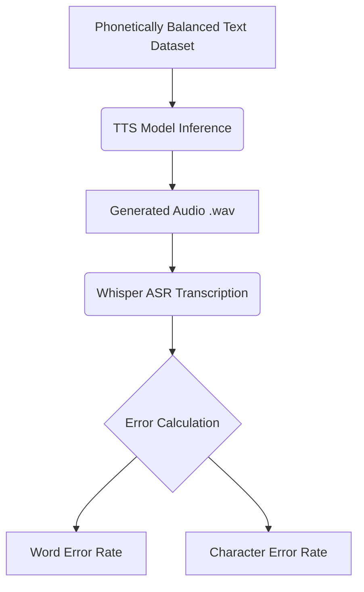

<p align="center">
  <h1 align="center">🗣️ Indian TTS Models — Benchmarking Standards</h1>
  <p align="center">
    <strong>Establishing benchmarking standards for Indian Language Speech Models,<br>focusing on Text-to-Speech (TTS) Synthesis</strong>
  </p>
  <p align="center">
    <a href="#models-tested">Models Tested</a> •
    <a href="#quantitative-evaluation-results">Evaluation Results</a> •
    <a href="#repository-structure">Repository Structure</a> •
    <a href="#getting-started">Getting Started</a>
  </p>
</p>

---

## 📋 Project Overview

This project benchmarks open-source and API-based **Text-to-Speech (TTS)** models for **Indian languages**, with an initial focus on **Hindi**. The goal is to establish a standardized evaluation framework for comparing Indian language speech synthesis models across key quality dimensions — naturalness, intelligibility, prosody, and voice cloning fidelity.

This work is carried out as part of an internship at **[Kaliber.AI](https://kaliber.ai) / Bay Area Advanced Analytics**.

### 🎯 Objectives

- Survey and catalog available TTS models supporting Indian languages
- Define a reproducible benchmarking methodology for Indian language TTS
- Compare models across naturalness, intelligibility, accent accuracy, and multi-speaker support
- Produce sample audio outputs for side-by-side subjective evaluation
- Provide ready-to-run notebooks for testing each model on Google Colab

---

## 🧠 Models Tested

We evaluated **7 TTS models** spanning open-source research models, community models, and commercial API services:

| # | Model | Source | Architecture Type | Voice Cloning |
|:-:|-------|--------|-------------------|:-------------:|
| 1 | **XTTS v2** | [Coqui TTS](https://github.com/coqui-ai/TTS) | Auto-regressive Transformer | ✅ |
| 2 | **Meta MMS** | [Meta Research](https://huggingface.co/facebook/mms-tts) | VITS-based | ❌ |
| 3 | **VITS Rasa 13** | [AI4Bharat](https://huggingface.co/ai4bharat/vits_rasa_13) | VITS (Adversarial learning) | ❌ |
| 4 | **Indic Parler-TTS** | [AI4Bharat](https://huggingface.co/ai4bharat/indic-parler-tts) | Encoder-Decoder Transformer | ❌ |
| 5 | **Kokoro** | [Kokoro-82M](https://huggingface.co/hexgrad/Kokoro-82M) | StyleTTS-based | ❌ |
| 6 | **TTSMaker** | [TTSMaker](https://ttsmaker.com/) | Commercial API | ❌ |
| 7 | **Suno Bark** | [Suno AI](https://github.com/suno-ai/bark) | Transformer-based Text-to-Audio | ✅ |

---

## 📊 Quantitative Evaluation Results

To rigorously test the intelligibility and pronunciation of each model, we generated a **Custom Phonetically Balanced Hindi Dataset** (`datasets/hindi_evaluation_set.json`). This dataset targets challenging Indian language phonemes, including Velars, Gutturals, Retroflexes, Palatals, and Nasals.

We processed the generated audio through an automated **Whisper ASR pipeline** to compute the Word Error Rate (WER) and Character Error Rate (CER).

### 🏆 Model Leaderboard (Hindi Phonetics)

| Rank | Model | Word Error Rate (WER) | Character Error Rate (CER) |
|:----:|-------|:---------------------:|:--------------------------:|
| 🥇 | **Kokoro** | **0.359** | **0.129** |
| 🥈 | **XTTS v2** | 0.525 | 0.217 |
| 🥉 | **Meta MMS** | 0.566 | 0.209 |
| 4 | **VITS Rasa 13** | 0.573 | 0.232 |
| 5 | **Suno Bark** | 0.616 | 0.292 |
| 6 | **Indic Parler-TTS** | 0.892 | 0.645 |

*(Note: Lower is better. TTSMaker was excluded from bulk automated evaluation due to API constraints.)*

---

## ⚙️ Evaluation Pipeline Architecture



---

## 🔍 Detailed Model Breakdowns

### 🥇 1. Kokoro (82M)
- **Architecture:** Lightweight TTS model based on StyleTTS architecture (82 million parameters).
- **Key Feature:** Extremely fast generation, high quality, and supports multiple voices natively.
- **Results:** Achieved the absolute best performance on our phonetically balanced Hindi tests with a WER of 0.359.
- **Workspace:** [`models/kokoro/`](models/kokoro/)

### 🥈 2. XTTS v2 (Coqui TTS)
- **Architecture:** Auto-regressive transformer-based TTS with voice cloning.
- **Key Feature:** Zero-shot voice cloning from a short audio reference (~6 seconds).
- **Results:** Extremely natural voice cloning capabilities, ranking second in overall intelligibility.
- **Workspace:** [`models/voice_cloning/xtts-v2/`](models/voice_cloning/xtts-v2/)

### 🥉 3. Meta MMS (Massively Multilingual Speech)
- **Architecture:** VITS-based model trained on 1,100+ languages.
- **Key Feature:** Broadest language coverage of any TTS model.
- **Results:** Consistent performance across diverse phonemes, slightly edging out VITS Rasa.
- **Workspace:** [`models/meta-mms/`](models/meta-mms/)

### 4. VITS Rasa 13 (AI4Bharat)
- **Architecture:** VITS (Variational Inference with adversarial learning for end-to-end TTS).
- **Key Feature:** Native support for 13 Indian languages with multiple speaker IDs & emotion styles.
- **Workspace:** [`models/vits-rasa/`](models/vits-rasa/)

### 5. Indic Parler-TTS (AI4Bharat)
- **Architecture:** Encoder-decoder transformer with DAC audio codec.
- **Key Feature:** Natural language voice description prompting (e.g., "A female speaker with a calm voice").
- **Workspace:** [`models/indic-parler/`](models/indic-parler/)

---

## 📁 Repository Structure

The repository is organized functionally by **model**:

```text
Indian-TTS-models/
├── README.md                        # This presentation document
├── requirements.txt                 # Python dependencies
├── .gitignore                       # Git ignore rules
│
├── datasets/                        # Large testing datasets
│   ├── dataset_48.5_41.5.zip
│   ├── hindi_evaluation_set.json
│   └── IndicVoices_Audio.zip
│
├── docs/                            # Documentation & overview spreadsheets
│   ├── Indian_TTS_Models_Overview.xlsx
│   ├── IndicVoices_VITS_Evaluation.csv
│   └── Kokoro_Evaluation_Results.csv
│
├── models/                          # The Core Model Workspaces
│   ├── indic-parler/
│   ├── kokoro/
│   │   ├── notebooks/
│   │   ├── samples/
│   │   ├── phonetic_evaluation/     # ASR evaluation CSVs and result ZIPs
│   │   └── assets/                  # Visual Dashboards
│   ├── meta-mms/
│   ├── suno-bark/
│   ├── tts-maker/
│   ├── vits-rasa/
│   └── voice_cloning/
│       └── xtts-v2/                 # Isolated workspace for zero-shot cloning
│
└── utility_notebooks/               # Bulk testing and evaluation scripts
    ├── Evaluating_TTS_models.ipynb
    └── Testing_Indian_TTS_models.ipynb
```

---

## 🚀 Getting Started

### Prerequisites
- Python 3.10+
- Google Colab (recommended for GPU access) or a local machine with NVIDIA GPU.
- Hugging Face account with API token (for gated models like Parler).

### Installation
```bash
# Clone the repository
git clone https://github.com/JayGang07/Indian-TTS-models.git
cd Indian-TTS-models

# Install dependencies
pip install -r requirements.txt
```

### Running on Google Colab
Navigate to any model's `notebooks/` directory and open the `.ipynb` file.

> **⚠️ Important:** Some models (Indic Parler-TTS, XTTS v2, Suno Bark) require a **GPU runtime**.  
> In Colab: `Runtime → Change runtime type → T4 GPU`

### Hugging Face Authentication
For models hosted on Hugging Face, authenticate using:
```python
from huggingface_hub import login
login(token="your_hf_token_here")
```

---

## 🤝 Acknowledgements

This project is part of an internship at **[Kaliber.AI](https://kaliber.ai) / Bay Area Advanced Analytics**.

- [AI4Bharat](https://ai4bharat.org/) for Indic Parler-TTS and VITS Rasa models
- [Hugging Face](https://huggingface.co/) for model hosting and the Transformers library
- [Meta Research](https://ai.meta.com/) for MMS
- [Suno AI](https://www.suno.ai/) for Bark
- [Hexgrad](https://huggingface.co/hexgrad) for the amazing Kokoro-82M model
