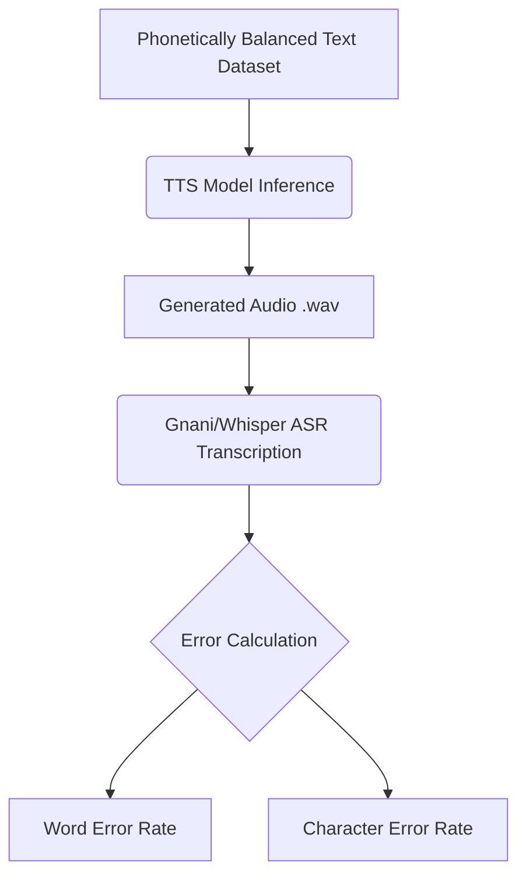

<p align="center">
 <h1 align="center"> Indian TTS Models — Benchmarking Standards</h1>
 <p align="center">
 <strong>Establishing benchmarking standards for Indian Language Speech Models,<br>focusing on Text-to-Speech (TTS) Synthesis</strong>
 
---

## Project Overview

This project benchmarks open-source and API-based **Text-to-Speech (TTS)** models for **Indian languages**, with evaluation across **Hindi, Bengali, and Assamese**. The goal is to establish a standardized evaluation framework for comparing Indian language speech synthesis models across key quality dimensions — naturalness, intelligibility, prosody, and voice cloning fidelity.

This work is carried out as part of an internship at **[Kaliber.AI](https://kaliber.ai) / Bay Area Advanced Analytics**.

### Objectives

- Survey and catalog available TTS models supporting Indian languages
- Define a reproducible benchmarking methodology for Indian language TTS
- Compare models across naturalness, intelligibility, accent accuracy, and multi-speaker support
- Produce sample audio outputs for side-by-side subjective evaluation
- Provide ready-to-run notebooks for testing each model on Google Colab

---

## Models Tested

> [!NOTE]
> For a comprehensive overview, including detailed features and comparisons, view the **[Indian TTS Models Overview Spreadsheet](https://docs.google.com/spreadsheets/d/1lPsC1ouOFhUqIAKhp-tiZ-qPhk6zHms_j6_Iq5txx0g/edit?gid=37611081#gid=37611081)**.

We evaluated **12 TTS models** spanning open-source research models, community models, and commercial API services:

| # | Model | Source | Architecture Type | Year | Parameters | Voice Cloning | Hindi | Bengali | Assamese |
|:-:|-------|--------|-------------------|:----:|:----------:|:-------------:|:-----:|:-------:|:--------:|
| 1 | **XTTS v2** | [Coqui TTS](https://github.com/coqui-ai/TTS) | Auto-regressive Transformer | 2023 | 518M | Yes | Yes | No | No |
| 2 | **Meta MMS** | [Meta Research](https://huggingface.co/facebook/mms-tts) | VITS-based | 2023 | 300M | No | Yes | Yes | Yes |
| 3 | **Suno Bark** | [Suno AI](https://github.com/suno-ai/bark) | Transformer-based Text-to-Audio | 2023 | 550M | No | Yes | No | No |
| 4 | **VITS Rasa 13** | [AI4Bharat](https://huggingface.co/ai4bharat/vits_rasa_13) | VITS (Adversarial learning) | 2024 | 40.2M | No | Yes | Yes | Yes |
| 5 | **Indic Parler-TTS** | [AI4Bharat](https://huggingface.co/ai4bharat/indic-parler-tts) | Encoder-Decoder Transformer | 2024 | 938M | No | Yes | Yes | Yes |
| 6 | **Kokoro** | [Kokoro-82M](https://huggingface.co/hexgrad/Kokoro-82M) | StyleTTS-based | 2024 | 82M | No | Yes | No | No |
| 7 | **Kokoclone** | Community Model | StyleTTS-based | 2025 | 82M | Yes | Yes | No | No |
| 8 | **Spark-TTS** | [Spark-TTS](https://github.com/QwenLM/Spark-TTS) | Qwen2.5 LLM + BiCodec | 2025 | 500M | Yes | Yes | No | No |
| 9 | **Indic F5** | [AI4Bharat](https://github.com/ai4bharat/IndicF5) | Flow-matching Transformer (F5-TTS) | 2025 | ~300M | Yes | Yes | Yes | Yes |
| 10 | **Sarvam AI (Bulbul v3)** | [Sarvam AI](https://www.sarvam.ai/) | LLM-based TTS (API) | 2025 | N/A (API) | No | Yes | Yes | No |
| 11 | **CosyVoice 3** | [Alibaba](https://github.com/FunAudioLLM/CosyVoice) | Flow Matching Transformer | 2024 | ~1B | Yes | No | Yes | No |
| 12 | **Xobdo Boroxa** | Community Model | - | 2024 | - | - | No | No | Yes |

---

## Datasets available for cloning 

The datasets we considered for voice cloning models:

| Dataset | Hours | Languages | Speakers / Accents |
|---------|-------|-----------|--------------------|
| **[Rasa](https://huggingface.co/datasets/ai4bharat/Rasa)** | 400 | 13 | 20 |
| **[IndicVoices](https://huggingface.co/datasets/ai4bharat/indicvoices)** | 7,200 | 22 | 16,237 |
| **[GLOBE](https://huggingface.co/datasets/collabora/globe)** | 535 | English | 164 global accents |
| **[IndicVoices_r](https://huggingface.co/datasets/ai4bharat/indicvoices_r)** | 1,700 | 22 | 10,496 |
| **[SPICOR](https://spiredatasets.ee.iisc.ac.in/)** | 154 | Indian English, Gujarati | 4 |

---

## Phonetically Balanced Dataset Breakdown

### What is a Phonetically Balanced Dataset?
A **phonetically balanced dataset** is a collection of text or audio data that contains all the distinct sounds (phonemes) of a language in the same proportion that they naturally occur in everyday conversation. Rather than just using random sentences, these datasets are carefully constructed to ensure TTS models learn how to pronounce both common sounds and rare edge-case letters accurately.

**Example:** Instead of a simple sentence like "Hello, my name is Jay," a phonetically dense Hindi sentence might be deliberately written to include loan words, nasal sounds, and aspirated consonants (e.g., "ज़ुबैर ने फ़र्ज़ निभाते हुए क़िले के पास से गुज़रते हुए एक ख़त पढ़ा।") to force the model to render rare phonemes like 'ज़', 'फ़', 'क़', and 'ख़'.

To rigorously test the intelligibility and pronunciation of each model, we generated **Custom Phonetically Balanced Datasets** for three languages:
- **Hindi** — `datasets/hindi_evaluation_set.json`
- **Bengali** — `datasets/bengali_evaluation_set.json`
- **Assamese** — `datasets/assamese_evaluation_set.json`

Each dataset targets challenging phonemes specific to that language, including Velars, Gutturals, Retroflexes, Palatals, Nasals, and language-specific edge cases.

### Hindi Phoneme Frequencies
- Phoneme अ (Schwa): 250
- Phoneme ् (Vowel Length Modifier): 170
- Phoneme क्: 90
- Phoneme र्: 86
- Phoneme आ: 84
- Phoneme ए: 75
- Phoneme इ / ई: 67
- Phoneme त्: 57
- Phoneme न्: 51
- Phoneme म्: 47
- Phoneme श्: 36
- Phoneme द्: 34
- Phoneme उ / ऊ: 32
- Phoneme ल्: 30
- Phoneme ् (Aspiration Modifier / महाप्राण): 30
- Phoneme ह् (Voiced): 28
- Phoneme प्: 27
- Phoneme स्: 27
- Phoneme ऑ (English Loan): 24
- Phoneme य्: 24
- Phoneme ग्: 23
- Phoneme ट्: 21
- Phoneme ब्: 19
- Phoneme व्: 19
- Phoneme झ़् (Nukta/Loan): 17
- Phoneme ओ: 15
- Phoneme ड़् (Flap): 12
- Phoneme ऐ: 11
- Phoneme ड्: 7
- Phoneme ज़् (Nukta): 7
- Phoneme फ़् (Nukta): 6
- Phoneme आँ (Nasalized): 6
- Phoneme ञ्: 5
- Phoneme ष्: 3
- Phoneme ण्: 3
- Phoneme ङ्: 3
- Phoneme क़् (Nukta): 3
- Phoneme ऊँ (Nasalized): 3
- Phoneme ख़् (Nukta): 2
- Phoneme ह्: 2
- Phoneme ग़् (Nukta): 1

### Summary of Dataset Design

**1. The Natural Dominance of the Schwa (अ)**
The phoneme 'अ' (schwa) is the absolute backbone of the Hindi language. Every standard consonant in Devanagari inherently carries a schwa unless heavily modified. If a dataset forced an artificially low number of 'अ' sounds just to match rare consonants, the sentences would sound robotic, entirely unnatural, and grammatically impossible.

**2. Representative Vowel Lengths (Long Vowels / मात्राएँ)**
The high frequency of long vowel modifiers (170 occurrences) represents vowel lengthening (like आ, ई, ऊ, ए). Hindi is a syllable-timed language where vowel length changes the entire meaning of a word (e.g., kam vs. kaam). A high number of length modifiers ensures the model gets enough sustained vowel data to learn proper pitch and tone.

**3. Inclusion of the "Long Tail" (The Rare Sounds)**
This is where the true "balance" of this dataset shines. In a random selection of 20 conversational Hindi sentences, you would likely find zero instances of sounds like 'क़', 'ख़', 'ग़', or the aspirated flap 'ढ़'.
By deliberately writing sentences like the loan_words_nukta and perso_arabic_nukta ones, the dataset forces these rare edge cases to appear:
- 'ज़' (7 times)
- 'फ़' (6 times)
- 'क़' (3 times)
- 'ख़' (2 times)
- 'ग़' (1 time)

Even though they only appear a few times, their guaranteed presence means an acoustic model is forced to process them, preventing the system from collapsing them into standard sounds (like turning 'ज़' into 'ज' or 'फ़' into 'फ').

**4. Broad Consonant Class Coverage**
If you group the mid-frequency numbers, you can see the articulatory balancing act at play:
- Velars/Throat: 'क' (90), 'ग' (23)
- Dentals/Alveolars: 'त' (57), 'द' (34), 'न' (51)
- Labials/Lips: 'प' (27), 'ब' (19), 'म' (47)
- Retroflexes (Curled Tongue): 'ट' (21), 'ड' (7), 'ड़' (12)

### Bengali Phonetically Balanced Dataset (`datasets/bengali_evaluation_set.json`)

The Bengali evaluation set contains **20 carefully crafted sentences** targeting phonemes unique to Bengali, including:

| Category | Phonetic Targets | Example Phonemes |
|----------|-----------------|------------------|
| **Missing Nasals & Terminal Aspirates** | /ĩ/ (ইঁ), /ũ/ (উঁ), terminal /kʰ/, /t̪ʰ/, /bʰ/ | ইঁ, উঁ, নখ, রথ |
| **Conjuncts (যুক্তাক্ষর)** | /lg/ (ল্গ), /nɖ/ (ন্ড), /nʈ/ (ন্ট), /mp/ (ম্প) | ফাল্গুন, ভণ্ড, ঘণ্টা, কম্পন |
| **Gemination (দ্বিত্ব)** | /cc/ (চ্চ), /ʈʈ/ (ট্ট), /dd/ (দ্দ) | উচ্চ, অট্টালিকা, উদ্দাম |
| **Velars & Fricatives** | /k/, /kʰ/, /g/, /gʰ/, /ŋ/ and /ʃ/ vs /s/ | ক, খ, গ, ঘ, ং |
| **Palatals & Affricates** | /c/ (চ), /cʰ/ (ছ), /dʒ/ (জ), /dʒʰ/ (ঝ) | চ, ছ, জ, ঝ |
| **Loan Fricatives (Code-Mixing)** | /z/ (জ়), /f/ (ফ), English /æ/ (ল্যা) | জুম, ফাইল, ল্যাপটপ |
| **English Clusters** | /ʈr/ (ট্র), /ɖr/ (ড্র), /bl/ (ব্লু), /skr/ (স্ক্রি) | ট্রেন, ড্রাইভার, ব্লুটুথ |
| **Heavy Nasalization** | /ã/ (বাঁ), /õ/ (ভোঁ), /æ̃/ (ক্যাঁ/প্যাঁ) | বাঁশ, ভোঁতা, ক্যাঁকচেঁক |
| **Complex Conjuncts** | /gj/ (জ্ঞ), /sp/ (স্প), /pr/ (প্র), /ŋg/ (ঙ্গ) | প্রজ্ঞা, প্রাঙ্গণ, উপস্থিতি |
| **য-ফলা (y-fala)** | Extensive /æ/ mapping (ব্যা, ম্যা, গ্যা, ট্যা) | ব্যাঙ্ক, ম্যানেজার, গ্যারাজ |
| **Diphthongs** | /ou/ (নৌ), /oi/ (থৈ) | নৌকো, থৈথৈ |

### Assamese Phonetically Balanced Dataset (`datasets/assamese_evaluation_set.json`)

The Assamese evaluation set contains **20 carefully crafted sentences** targeting the distinct phonological features of Assamese, including:

| Category | Phonetic Targets | Example Phonemes |
|----------|-----------------|------------------|
| **Velar Fricatives & Glottals** | /x/ (স, শ, ষ) and /h/ (হ) — unique Assamese shift | শ→/x/, স→/x/, ঘাঁহ |
| **Alveolar Fricatives** | /s/ for চ and ছ, /z/ for জ (Assamese phonology) | চ→/s/, ছ→/s/, জ→/z/ |
| **Rhotics** | Assamese-specific /ɹ/ pronunciation of ড়/ঢ় | আষাঢ়, আঢ়ৈ |
| **Semi-vowels** | /w/ (ৱ) — unique to Assamese script | ৱ, উৎসৱ |
| **Gemination** | /ʈʈ/ (ট্ট), /dd/ (দ্দ), /bd/ (ব্দ) | অট্টালিকা, উদ্দাম |
| **Heavy Nasalization** | /ã/ (বাঁ), /õ/ (ভোঁ), /ẽ/ (ফেঁ) | বাঁহ, ভোঁতা, ফেঁচা |
| **Code-Mixing** | English loan words adapted to Assamese phonotactics | জুম, ব্ৰাইটনেছ, ফৰৱাৰ্ড |
| **Complex Glides/Triphthongs** | /aij/ (খাইয়েই), /aõt/ (চাওঁতে) | খাইয়েই, চাওঁতে |
| **Diphthongs** | /ɔu/ (চৌ), /ɔi/ (থৈ) | চৌকা, থৈ-থৈ |
| **Sanskrit-derived Clusters** | /kkhn/ (ক্ষ্ণ), /ɲs/ (ঞ্ছ), /gj/ (জ্ঞ) | তীক্ষ্ণ, বাঞ্ছা, প্রজ্ঞা |

### Models Tested

Of the models in our benchmark, they support the following languages:

| Model | Hindi | Bengali | Assamese |
|-------|:-----:|:-------:|:--------:|
| **Kokoro** | Yes | No | No |
| **Suno Bark** | Yes | No | No |
| **XTTS v2** | Yes | No | No |
| **Meta MMS** | Yes | Yes | Yes |
| **VITS Rasa 13** | Yes | Yes | Yes |
| **Indic Parler-TTS** | Yes | Yes | Yes |
| **Kokoclone** | Yes | No | No |
| **Spark TTS** | Yes | No | No |
| **Indic F5** | No | Yes | Yes |
| **Sarvam AI (Bulbul v3)** | Yes | Yes | No |
| **CosyVoice 3** | No | Yes | No |
| **Xobdo Boroxa** | No | No | Yes |

---

## Evaluation Metrics

To thoroughly compare these models, we relied on a combination of human-centric and automated evaluation metrics:

### Subjective Metrics (Human Evaluation)
- **MOS (Mean Opinion Score):** Rates the overall naturalness and quality of the generated speech on a 1-5 scale.
- **Comparative MOS (CMOS):** Directly compares two audio samples side-by-side to determine which sounds better.
- **ABX Testing:** A listener is presented with two samples (A and B) and must identify which one matches a reference sample (X) most closely, heavily used for testing voice cloning fidelity.

### Objective Metrics (Automated Evaluation)
- **WER (Word Error Rate):** Measures how many words were transcribed incorrectly.
- **CER (Character Error Rate):** Measures character-level spelling and phonetic mistakes.
- **STOI (Short-Time Objective Intelligibility):** Computes the intelligibility of synthesized speech based on acoustic features.
- **PESQ (Perceptual Evaluation of Speech Quality):** An objective method for predicting subjective quality scores of speech.

---

## Quantitative Evaluation Results

We evaluated the models through an automated **Whisper ASR pipeline** to compute the objective metrics — Word Error Rate (WER) and Character Error Rate (CER) — alongside human-evaluated Mean Opinion Score (MOS) for subjective quality.

### Model Leaderboard (Hindi Phonetics)

| Rank | Model | WER (Objective) | CER (Objective) | MOS (Subjective) |
|:----:|-------|:---------------:|:---------------:|:----------------:|
| 1 | **Kokoro** | **0.359** | **0.129** | **4.65** |
| 2 | **Suno Bark** | 0.616 | 0.292 | 4.11 |
| 3 | **XTTS v2** | 0.525 | 0.217 | 3.00 |
| 4 | **Meta MMS** | 0.566 | 0.209 | 2.52 |
| 5 | **VITS Rasa 13** | 0.573 | 0.232 | 2.03 |
| 6 | **Indic Parler-TTS** | 0.892 | 0.645 | 0.53 |
| 7 | **Kokoclone** | 0.793 | 0.642 | 0.00 |
| 8 | **Spark TTS** | 0.981 | 0.842 | 0.00 |
| - | **Sarvam AI (Bulbul v3)** | 0.435 | 0.435 | 4 |

### Model Leaderboard (Bengali Phonetics)

> [!NOTE]
> WER and CER for Bengali evaluated using **Gnani ASR (Prisma v2.5)**. MOS is a subjective human rating (1–5 scale) averaged across 20 phonetically balanced sentences.

| Rank | Model | WER (Objective) | CER (Objective) | MOS (Subjective) |
|:----:|-------|:---------------:|:---------------:|:----------------:|
| 1 | **Sarvam AI - Female (ritu)** | **0.197** | **0.071** | **4.00** |
| 2 | **Sarvam AI - Male (shubh)** | 0.200 | 0.067 | 4.00 |
| 3 | **CosyVoice 3** | 0.236 | 0.076 | 3.50 |
| 4 | **VITS Rasa 13** | 0.237 | 0.081 | 3.50 |
| 5 | **Meta MMS** | 0.305 | 0.113 | 2.50 |
| 6 | **Indic F5** | 0.1845 | 0.0717 | 2.50 |
| 7 | **Indic Parler-TTS** | 0.6581 | 0.5406 | 1.00 |

### Model Leaderboard (Assamese Phonetics)

> [!NOTE]
> WER and CER for Assamese evaluated using **Gnani ASR (Prisma v2.5)**. MOS is a subjective human rating (1–5 scale) averaged across 20 phonetically balanced sentences.

| Rank | Model | WER (Objective) | CER (Objective) | MOS (Subjective) |
|:----:|-------|:---------------:|:---------------:|:----------------:|
| 1 | **Indic F5** | **0.302** | **0.091** | **3.95** |
| 2 | **Xobdo Boroxa** | 0.324 | 0.105 | 3.75 |
| 3 | **VITS Rasa 13** | 0.363 | 0.123 | 3.80 |
| 4 | **Meta MMS** | 0.468 | 0.169 | 3.05 |
| 5 | **Indic Parler-TTS** | 0.665 | 0.411 | 1.05 |


---

## Evaluation Pipeline Architecture



### Gnani ASR (Prisma v2.5) Transcription Engine

For Indian languages like Bengali and Assamese, we chose **Gnani ASR (Prisma v2.5)** as the primary transcription engine for our evaluations. While Whisper is excellent for many global languages, Gnani's models are purpose-built for the intricacies of Indian regional dialects, code-mixing (English + regional), and complex phonologies (like Assamese rhotics or Bengali conjuncts). This allows us to get a much more accurate and fair WER/CER representation for Indian TTS models that might otherwise be penalized by generic ASR failure rather than actual generation flaws.

### Whisper ASR Transcription Engine

The pipeline utilizes OpenAI's Whisper model for robust ASR transcription. Whisper is available in multiple model sizes depending on the hardware and accuracy requirements:

1. **Tiny (39M parameters)**: The fastest and most lightweight model. Excellent for fast note-taking or low-power devices, but prone to higher error rates on complex audio.
2. **Base (74M parameters)**: A great balance of speed and size. Requires very little memory and transcribes quickly on almost any hardware.
3. **Small (244M parameters)**: Highly recommended for a mix of good transcription accuracy and reasonable processing time on modern computers.
4. **Medium (769M parameters)**: Offers high accuracy and handles background noise well, but requires a dedicated GPU or more powerful processors to run smoothly.
5. **Large (1.55B parameters)**: The most accurate and robust model, perfect for professional transcriptions. It features three iterations:
   - **large-v1 & large-v2**: Previous iterations of the large model.
   - **large-v3**: The latest standard large release, trained on more diverse datasets for superior multilingual accuracy.

#### Whisper Models Hardware & Performance Breakdown

| Model | Params | English-Only | VRAM (GPU) | GGML Disk | RAM (whisper.cpp) | Speed | English WER | Multilingual WER |
|---|---|---|---|---|---|---|---|---|
| **tiny** | 39 M | `tiny.en` | ~1 GB | 75 MiB | ~273 MB | ~10x | ~7.6% | ~12% |
| **base** | 74 M | `base.en` | ~1 GB | 142 MiB | ~388 MB | ~7x | ~5.0% | ~10% |
| **small** | 244 M | `small.en` | ~2 GB | 466 MiB | ~852 MB | ~4x | ~3.4% | ~7% |
| <mark>**medium**</mark> | <mark>**769 M**</mark> | <mark>**`medium.en`**</mark> | <mark>**~5 GB**</mark> | <mark>**1.5 GiB**</mark> | <mark>**~2.1 GB**</mark> | <mark>**~2x**</mark> | <mark>**~2.9%**</mark> | <mark>**~5%**</mark> |
| **large-v2** | 1,550 M | N/A | ~10 GB | 2.9 GiB | ~3.9 GB | 1x | ~2.7% | ~4% |
| **large-v3** | 1,550 M | N/A | ~10 GB | 2.9 GiB | ~3.9 GB | 1x | ~2.4% | ~3.5% |


### Understanding Error Metrics (WER & CER)

#### Word Error Rate (WER)
When WER is calculated, the errors are further broken down into:
1. **Substitutions (S)**: The TTS engine mispronounces a word, causing the ASR to hear a completely different word (e.g., saying “cataracts” instead of “Cadillac”).
2. **Deletions (D)**: The TTS cuts off early or skips a word completely.
3. **Insertions (I)**: The TTS model hallucinates or adds extra words, filler syllables, or stammers.

$$WER = \frac{S + I + D}{N} \times 100$$

> **Note:** In modern TTS development, a low WER indicates the audio is highly intelligible. However, WER does not measure voice naturalness, emotion, or prosody—a robotic-sounding voice can still be highly intelligible with a 0% WER.

#### Character Error Rate (CER)
The CER formula is a metric used to evaluate the accuracy of AI text models, speech-to-text, and OCR software by measuring character-level differences.

$$CER = \frac{S + D + I}{N}$$

**Where:**
- **S** = Substitutions (wrong characters in place of correct ones)
- **D** = Deletions (characters missing from the AI output)
- **I** = Insertions (extra characters incorrectly added to the output)
- **N** = Total number of characters in the original, correct reference text

**How to Calculate It:**
1. Align the AI's output with the correct, human-verified reference text.
2. Count the minimum number of single-character edits (S + D + I) needed to change the output into the reference text.
3. Divide this sum by the total length of the reference text (N).
4. Multiply by 100 to get a percentage.

---

## Detailed Model Breakdowns

### 1. Kokoro (82M)
- **Architecture:** Lightweight TTS model based on StyleTTS architecture (82 million parameters).
- **Key Feature:** Extremely fast generation, high quality, and supports multiple voices natively.
- **Results:** Achieved the absolute best performance on our phonetically balanced Hindi tests with a WER of 0.359.
- **Workspace:** [`models/kokoro/`](models/kokoro/)

### 2. XTTS v2 (Coqui TTS)
- **Architecture:** Auto-regressive transformer-based TTS with voice cloning.
- **Key Feature:** Zero-shot voice cloning from a short audio reference (~6 seconds).
- **Results:** Extremely natural voice cloning capabilities, ranking second in overall intelligibility.
- **Workspace:** [`models/voice_cloning/xtts-v2/`](models/voice_cloning/xtts-v2/)

### 3. Meta MMS (Massively Multilingual Speech)
- **Architecture:** VITS-based model trained on 1,100+ languages.
- **Key Feature:** Broadest language coverage of any TTS model.
- **Results:** Consistent performance across diverse phonemes, slightly edging out VITS Rasa.
- **Workspace:** [`models/meta-mms/`](models/meta-mms/)

### 4. VITS Rasa 13 (AI4Bharat)
- **Architecture:** VITS (Variational Inference with adversarial learning for end-to-end TTS).
- **Key Feature:** Native support for 13 Indian languages with multiple speaker IDs & emotion styles.
- **Workspace:** [`models/vits-rasa/`](models/vits-rasa/)

### 5. Indic Parler-TTS (AI4Bharat)
- **Architecture:** Encoder-decoder transformer with DAC audio codec.
- **Key Feature:** Natural language voice description prompting (e.g., "A female speaker with a calm voice").
- **Workspace:** [`models/indic-parler/`](models/indic-parler/)

### 6. Suno Bark
- **Architecture:** Transformer-based text-to-audio model (1.2B parameters).
- **Key Feature:** Can generate speech, music, and sound effects; supports multilingual synthesis.
- **Workspace:** [`models/suno-bark/`](models/suno-bark/)

### 7. KokoClone (Kokoro + Voice Cloning)
- **Architecture:** Kokoro-82M extended with voice cloning capabilities using speaker embeddings.
- **Key Feature:** Combines Kokoro's fast, high-quality synthesis with zero-shot voice cloning.
- **Indian Language Support:** Hindi (via `lang_code='h'`).
- **Workspace:** [`models/voice_cloning/kokoclone/`](models/voice_cloning/kokoclone/)

### 8. Spark-TTS
- **Architecture:** Qwen2.5 LLM + BiCodec-based TTS with voice cloning via audio prompts (~1.1B parameters).
- **Key Feature:** High-fidelity voice cloning and controllable speech generation with natural prosody.
- **Indian Language Support:** Hindi (via multi-lingual capability).
- **Workspace:** [`models/voice_cloning/spark-tts/`](models/voice_cloning/spark-tts/)

### 9. Indic F5 (AI4Bharat)
- **Architecture:** Flow-matching Transformer based on the F5-TTS architecture.
- **Key Feature:** High-quality speech synthesis for Indian languages with zero-shot voice cloning using a reference audio prompt from IndicVoices-R.
- **Indian Language Support:** Bengali, Assamese, and other Indic languages.
- **Workspace:** [`models/indic-f5/`](models/indic-f5/)

### 10. Sarvam AI — Bulbul v3 (API)
- **Architecture:** LLM-based TTS model with automatic text normalization and context-aware prosody.
- **Key Feature:** Commercial API service optimized for Indian languages with 30+ speaker voices, sub-250ms latency, and native Hinglish code-mixing support.
- **Indian Language Support:** 11 languages including Hindi (hi-IN) and Bengali (bn-IN).
- **Model:** `bulbul:v3` via the Sarvam AI Python SDK.
- **Results:** Evaluated on both Hindi and Bengali phonetic datasets with male (shubh) and female (ritu) speaker profiles.
- **Workspace:** [`models/sarvam-ai/`](models/sarvam-ai/)


## Repository Structure

The repository is organized functionally by **model**:

```text
Indian-TTS-models/
├── README.md                          # This presentation document
├── requirements.txt                   # Python dependencies
├── .gitignore                         # Git ignore rules
│
├── datasets/                          # Phonetically balanced evaluation datasets
│   ├── dataset_48.5_41.5.zip
│   ├── hindi_evaluation_set.json      # Custom phonetically balanced Hindi dataset
│   ├── bengali_evaluation_set.json    # Custom phonetically balanced Bengali dataset
│   └── assamese_evaluation_set.json   # Custom phonetically balanced Assamese dataset
│
├── docs/                              # Project-level documentation
│   └── Indian_TTS_Models_Overview.xlsx
│
├── models/                            # The Core Model Workspaces
│   ├── indic-f5/                      # Indic F5 (AI4Bharat)
│   │   ├── notebooks/                 # indic_f5_bengali.ipynb, indic_f5_assamese.ipynb
│   │   └── phonetic_evaluation/       # Bengali & Assamese audio ZIPs
│   │
│   ├── indic-parler/
│   │   ├── notebooks/                 # Hindi, Bengali, & Assamese evaluation notebooks
│   │   ├── samples/                   # Male & female Hindi audio samples
│   │   └── phonetic_evaluation/       # Hindi, Bengali, & Assamese evaluation results
│   │
│   ├── kokoro/
│   │   ├── notebooks/                 # kokoro.ipynb
│   │   ├── samples/                   # Male & female Hindi audio samples
│   │   ├── phonetic_evaluation/       # Phonetic + IndicVoices evaluation results
│   │   └── assets/                    # Visual dashboards (PNG)
│   │
│   ├── meta-mms/
│   │   ├── notebooks/                 # Hindi, Bengali, & Assamese evaluation notebooks
│   │   ├── samples/                   # Hindi audio sample
│   │   └── phonetic_evaluation/       # Hindi, Bengali, & Assamese evaluation results
│   │
│   ├── sarvam-ai/                     # [NEW] Sarvam AI — Bulbul v3 (API)
│   │   ├── notebooks/                 # sarvam_ai_hindi_bengali.ipynb
│   │   └── phonetic_evaluation/       # Hindi & Bengali audio output ZIPs
│   │
│   ├── suno-bark/
│   │   ├── notebooks/                 # suno_bark_phonetic_eval.ipynb
│   │   ├── samples/                   # Male & female Hindi audio samples
│   │   └── phonetic_evaluation/       # Whisper ASR evaluation CSV + audio ZIP
│   │
│   ├── tts-maker/
│   │   └── samples/                   # Male & female Hindi audio samples (MP3)
│   │
│   ├── vits-rasa/
│   │   ├── notebooks/                 # Hindi, Bengali, & Assamese evaluation notebooks
│   │   ├── samples/                   # Male & female Hindi audio samples
│   │   └── phonetic_evaluation/       # Hindi, Bengali, & Assamese evaluation results
│   │
│   └── voice_cloning/                 # Voice Cloning Models
│       ├── xtts-v2/
│       │   ├── notebooks/             # xtts.ipynb, xtts_v2.ipynb, xtts_phonetic_eval.ipynb
│       │   ├── samples/               # Hindi audio samples
│       │   └── phonetic_evaluation/   # Whisper ASR evaluation CSV + audio ZIP
│       │
│       ├── kokoclone/
│       │   ├── notebooks/             # kokoclone.ipynb
│       │   └── outputs/               # Evaluation output ZIP
│       │
│       └── spark-tts/
│           ├── notebooks/             # spark_tts.ipynb
│           └── outputs/               # TTS output ZIP
│
└── utility_notebooks/                 # Bulk testing and evaluation scripts
    ├── Evaluating_TTS_models.ipynb
    ├── Testing_Indian_TTS_models.ipynb
    └── VITS_rasa_finetune.ipynb       # Cross-model evaluation (VITS Rasa + Kokoro)
```

---

## Getting Started

### Prerequisites
- Python 3.10+
- Google Colab (recommended for GPU access) or a local machine with NVIDIA GPU.
- Hugging Face account with API token (for gated models like Parler).

### Installation
```bash
# Clone the repository
git clone https://github.com/JayGang07/Indian-TTS-models.git
cd Indian-TTS-models

# Install dependencies
pip install -r requirements.txt
```

### Running on Google Colab
Navigate to any model's `notebooks/` directory and open the `.ipynb` file.

> **⚠ Important:** Some models (Indic Parler-TTS, XTTS v2, Suno Bark) require a **GPU runtime**. 
> In Colab: `Runtime → Change runtime type → T4 GPU`

### Hugging Face Authentication
For models hosted on Hugging Face, authenticate using:
```python
from huggingface_hub import login
login(token="your_hf_token_here")
```

---

## Acknowledgements

This project is part of an internship at **[Kaliber.AI](https://kaliber.ai) / Bay Area Advanced Analytics**.

- [AI4Bharat](https://ai4bharat.org/) for Indic Parler-TTS and VITS Rasa models
- [Hugging Face](https://huggingface.co/) for model hosting and the Transformers library
- [Meta Research](https://ai.meta.com/) for MMS
- [Suno AI](https://www.suno.ai/) for Bark
- [Hexgrad](https://huggingface.co/hexgrad) for the amazing Kokoro-82M model
- [Sarvam AI](https://www.sarvam.ai/) for the Bulbul v3 TTS API

---

## References

- [Whisper Speech Recognition Model Capable of Recognizing 99 Languages](https://medium.com/axinc-ai/whisper-speech-recognition-model-capable-of-recognizing-99-languages-5b5cf0197c16)
- [Arxiv Paper 2501.00425](https://arxiv.org/abs/2501.00425)
- [Whisper Model Sizes Explained](https://openwhispr.com/blog/whisper-model-sizes-explained)
- [Whisper Models Directory](https://whisper-api.com/blog/models/)
- [Springer Link Reference](https://link.springer.com/chapter/10.1007/978-981-96-6960-8_6)
