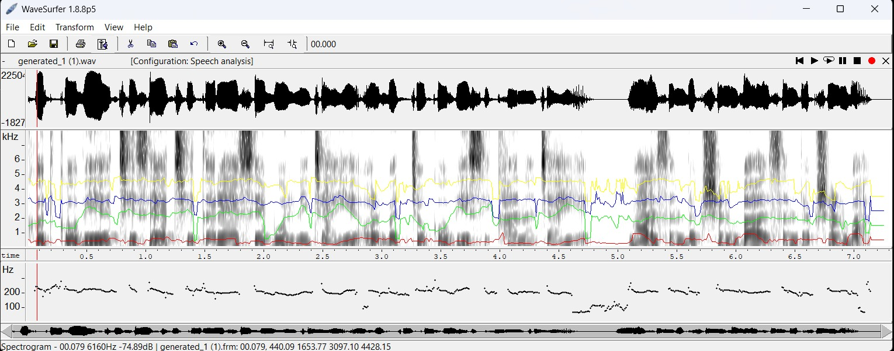
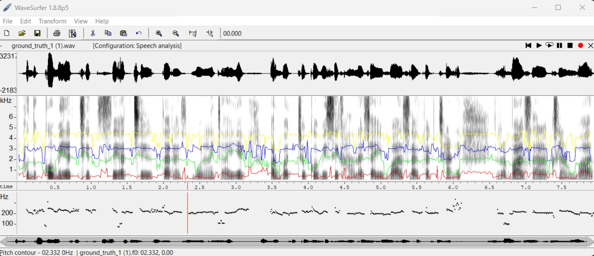
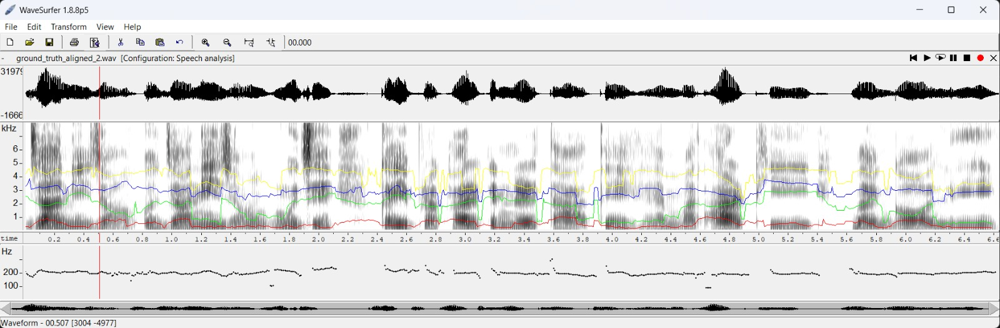
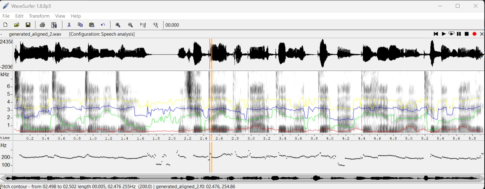
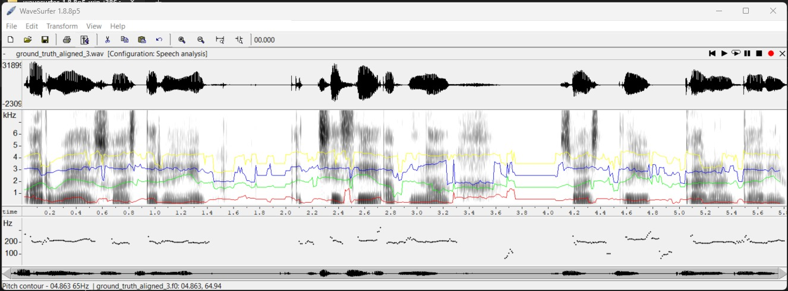
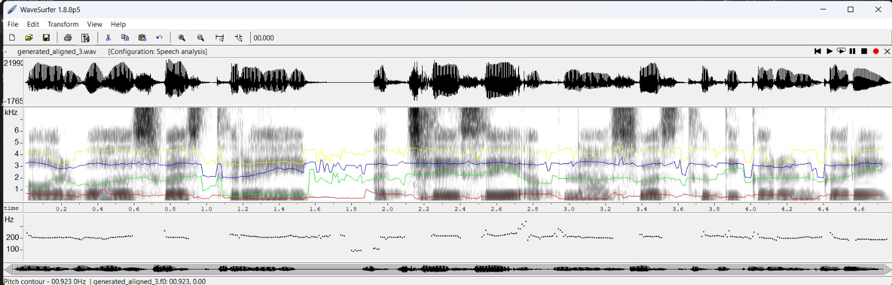
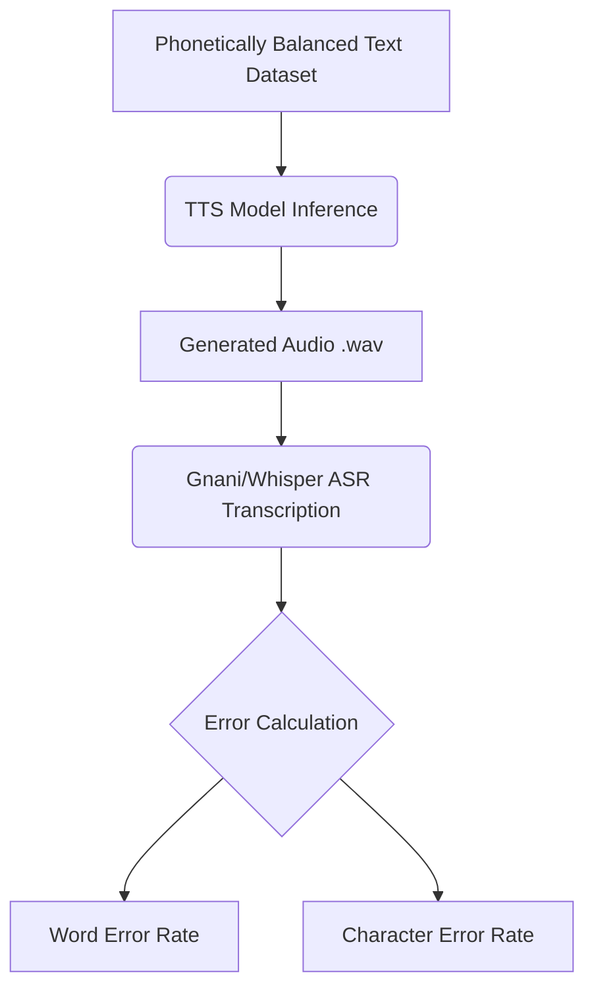

<p align="center">
 <h1 align="center"> Indian TTS Models — Benchmarking Standards</h1>
 <p align="center">
 <strong>Establishing benchmarking standards for Indian Language Speech Models,<br>focusing on Text-to-Speech (TTS) Synthesis</strong>
 
---

## Project Overview

This project benchmarks open-source and API-based **Text-to-Speech (TTS)** models for **Indian languages**, with evaluation across **Hindi, Bengali, Assamese, Nepali, Urdu, and Maithili**. The goal is to establish a standardized evaluation framework for comparing Indian language speech synthesis models across key quality dimensions — naturalness, intelligibility, prosody, and voice cloning fidelity.

This work is carried out as part of an internship at **[Kaliber.AI](https://kaliber.ai) / Bay Area Advanced Analytics**.

### Objectives

- Survey and catalog available TTS models supporting Indian languages
- Define a reproducible benchmarking methodology for Indian language TTS
- Compare models across naturalness, intelligibility, accent accuracy, and multi-speaker support
- Produce sample audio outputs for side-by-side subjective evaluation
- Provide ready-to-run notebooks for testing each model on Google Colab

---

## Models Tested

> [!NOTE]
> For a comprehensive overview, including detailed features and comparisons, view the **[Indian TTS Models Overview Spreadsheet](https://docs.google.com/spreadsheets/d/1lPsC1ouOFhUqIAKhp-tiZ-qPhk6zHms_j6_Iq5txx0g/edit?gid=37611081#gid=37611081)**.

We evaluated **19 TTS models** spanning open-source research models, community models, and commercial API services:

| # | Model | Source | Architecture Type | Year | Parameters | Voice Cloning | Hindi | Bengali | Assamese | Nepali | Urdu | Maithili |
|:-:|-------|--------|-------------------|:----:|:----------:|:-------------:|:-----:|:-------:|:--------:|:------:|:----:|:--------:|
| 1 | **XTTS v2** | [Coqui TTS](https://github.com/coqui-ai/TTS) | Auto-regressive Transformer | 2023 | 518M | Yes | Yes | No | No | No | No | No |
| 2 | **Meta MMS** | [Meta Research](https://huggingface.co/facebook/mms-tts) | VITS-based | 2023 | 300M | No | Yes | Yes | Yes | No | Yes | Yes |
| 3 | **Suno Bark** | [Suno AI](https://github.com/suno-ai/bark) | Transformer-based Text-to-Audio | 2023 | 550M | No | Yes | No | No | No | No | No |
| 4 | **VITS Rasa 13** | [AI4Bharat](https://huggingface.co/ai4bharat/vits_rasa_13) | VITS (Adversarial learning) | 2024 | 40.2M | No | Yes | Yes | Yes | No | No | No |
| 5 | **Indic Parler-TTS** | [AI4Bharat](https://huggingface.co/ai4bharat/indic-parler-tts) | Encoder-Decoder Transformer | 2024 | 938M | No | Yes | Yes | Yes | Yes | Yes | Yes |
| 6 | **Kokoro** | [Kokoro-82M](https://huggingface.co/hexgrad/Kokoro-82M) | StyleTTS-based | 2024 | 82M | No | Yes | No | No | No | No | No |
| 7 | **Kokoclone** | Community Model | StyleTTS-based | 2025 | 82M | Yes | Yes | No | No | No | No | No |
| 8 | **Spark-TTS** | [Spark-TTS](https://github.com/QwenLM/Spark-TTS) | Qwen2.5 LLM + BiCodec | 2025 | 500M | Yes | Yes | No | No | No | No | No |
| 9 | **Indic F5** | [AI4Bharat](https://github.com/ai4bharat/IndicF5) | Flow-matching Transformer (F5-TTS) | 2025 | ~300M | Yes | Yes | Yes | Yes | No | No | No |
| 10 | **Sarvam AI (Bulbul v3)** | [Sarvam AI](https://www.sarvam.ai/) | LLM-based TTS (API) | 2025 | N/A (API) | No | Yes | Yes | No | No | No | No |
| 11 | **CosyVoice 3** | [Alibaba](https://github.com/FunAudioLLM/CosyVoice) | Flow Matching Transformer | 2024 | ~1B | Yes | No | Yes | Yes | No | No | No |
| 12 | **Xobdo Boroxa** | Community Model | - | 2024 | - | - | No | No | Yes | No | No | No |
| 13 | **Vachana TTS (Gnani)** | [Gnani.ai](https://gnani.ai/) | Proprietary | 2024 | - | No | Yes | Yes | No | No | No | No |
| 14 | **TuskByte-v1** | [TuskByte](https://huggingface.co/tuskbyte/nepali_male_v1) | VITS-based | 2024 | - | No | No | No | No | Yes | No | No |
| 15 | **Oshara (XTTS v2 Nepali)** | [Oshara](https://huggingface.co/Oshara/xtts-v2-nepali) | Auto-regressive Transformer (Fine-tuned) | 2025 | 518M | Yes | Yes | No | No | Yes | No | No |
| 16 | **FastSpeech 2 (Piper/ESPnet)** | [SMTIITM](https://huggingface.co/smtiitm/Fastspeech2_HS) / [Ampixa](https://huggingface.co/ampixa/real-nepali-v0.2-kala) | FastSpeech 2 / VITS (Piper) | 2024 | ~40M | No | Yes | Yes | Yes | Yes | No | No |
| 17 | **Sooktam2 (F5-TTS)** | [AI4Bharat](https://github.com/ai4bharat/IndicF5) | Flow-matching Transformer (F5-TTS) | 2025 | ~300M | Yes | Yes | Yes | No | No | No | No |
| 18 | **Sonic v3** | [Cartesia](https://cartesia.ai/) | LLM-based TTS (API) | 2025 | N/A (API) | No | Yes | Yes | No | No | No | No |
| 19 | **Syspin VITS** | [SYSPIN](https://huggingface.co/SYSPIN/vits_Maithili_Female) | VITS (Coqui TTS) | 2024 | ~40M | No | No | No | No | No | No | Yes |

---

## Datasets available for cloning 

The datasets we considered for voice cloning models:

| Dataset | Hours | Languages | Speakers / Accents |
|---------|-------|-----------|--------------------|
| **[Rasa](https://huggingface.co/datasets/ai4bharat/Rasa)** | 400 | 13 | 20 |
| **[IndicVoices](https://huggingface.co/datasets/ai4bharat/indicvoices)** | 7,200 | 22 | 16,237 |
| **[GLOBE](https://huggingface.co/datasets/collabora/globe)** | 535 | English | 164 global accents |
| **[IndicVoices_r](https://huggingface.co/datasets/ai4bharat/indicvoices_r)** | 1,700 | 22 | 10,496 |
| **[SPICOR](https://spiredatasets.ee.iisc.ac.in/)** | 154 | Indian English, Gujarati | 4 |

---

## Phonetically Balanced Dataset Breakdown

### What is a Phonetically Balanced Dataset?
A **phonetically balanced dataset** is a collection of text or audio data that contains all the distinct sounds (phonemes) of a language in the same proportion that they naturally occur in everyday conversation. Rather than just using random sentences, these datasets are carefully constructed to ensure TTS models learn how to pronounce both common sounds and rare edge-case letters accurately.

**Example:** Instead of a simple sentence like "Hello, my name is Jay," a phonetically dense Hindi sentence might be deliberately written to include loan words, nasal sounds, and aspirated consonants (e.g., "ज़ुबैर ने फ़र्ज़ निभाते हुए क़िले के पास से गुज़रते हुए एक ख़त पढ़ा।") to force the model to render rare phonemes like 'ज़', 'फ़', 'क़', and 'ख़'.

To rigorously test the intelligibility and pronunciation of each model, we generated **Custom Phonetically Balanced Datasets** for six languages:
- **Hindi** — `datasets/hindi_evaluation_set.json`
- **Bengali** — `datasets/bengali_evaluation_set.json`
- **Assamese** — `datasets/assamese_evaluation_set.json`
- **Nepali** — `datasets/nepali_evaluation_set.json`
- **Urdu** — `datasets/urdu_balanced_set.json`
- **Maithili** — `datasets/maithili_balanced_set.json`

Each dataset targets challenging phonemes specific to that language, including Velars, Gutturals, Retroflexes, Palatals, Nasals, and language-specific edge cases.

### Hindi Phoneme Frequencies
- Phoneme अ (Schwa): 250
- Phoneme ् (Vowel Length Modifier): 170
- Phoneme क्: 90
- Phoneme र्: 86
- Phoneme आ: 84
- Phoneme ए: 75
- Phoneme इ / ई: 67
- Phoneme त्: 57
- Phoneme न्: 51
- Phoneme म्: 47
- Phoneme श्: 36
- Phoneme द्: 34
- Phoneme उ / ऊ: 32
- Phoneme ल्: 30
- Phoneme ् (Aspiration Modifier / महाप्राण): 30
- Phoneme ह् (Voiced): 28
- Phoneme प्: 27
- Phoneme स्: 27
- Phoneme ऑ (English Loan): 24
- Phoneme य्: 24
- Phoneme ग्: 23
- Phoneme ट्: 21
- Phoneme ब्: 19
- Phoneme व्: 19
- Phoneme झ़् (Nukta/Loan): 17
- Phoneme ओ: 15
- Phoneme ड़् (Flap): 12
- Phoneme ऐ: 11
- Phoneme ड्: 7
- Phoneme ज़् (Nukta): 7
- Phoneme फ़् (Nukta): 6
- Phoneme आँ (Nasalized): 6
- Phoneme ञ्: 5
- Phoneme ष्: 3
- Phoneme ण्: 3
- Phoneme ङ्: 3
- Phoneme क़् (Nukta): 3
- Phoneme ऊँ (Nasalized): 3
- Phoneme ख़् (Nukta): 2
- Phoneme ह्: 2
- Phoneme ग़् (Nukta): 1

### Summary of Dataset Design

**1. The Natural Dominance of the Schwa (अ)**
The phoneme 'अ' (schwa) is the absolute backbone of the Hindi language. Every standard consonant in Devanagari inherently carries a schwa unless heavily modified. If a dataset forced an artificially low number of 'अ' sounds just to match rare consonants, the sentences would sound robotic, entirely unnatural, and grammatically impossible.

**2. Representative Vowel Lengths (Long Vowels / मात्राएँ)**
The high frequency of long vowel modifiers (170 occurrences) represents vowel lengthening (like आ, ई, ऊ, ए). Hindi is a syllable-timed language where vowel length changes the entire meaning of a word (e.g., kam vs. kaam). A high number of length modifiers ensures the model gets enough sustained vowel data to learn proper pitch and tone.

**3. Inclusion of the "Long Tail" (The Rare Sounds)**
This is where the true "balance" of this dataset shines. In a random selection of 20 conversational Hindi sentences, you would likely find zero instances of sounds like 'क़', 'ख़', 'ग़', or the aspirated flap 'ढ़'.
By deliberately writing sentences like the loan_words_nukta and perso_arabic_nukta ones, the dataset forces these rare edge cases to appear:
- 'ज़' (7 times)
- 'फ़' (6 times)
- 'क़' (3 times)
- 'ख़' (2 times)
- 'ग़' (1 time)

Even though they only appear a few times, their guaranteed presence means an acoustic model is forced to process them, preventing the system from collapsing them into standard sounds (like turning 'ज़' into 'ज' or 'फ़' into 'फ').

**4. Broad Consonant Class Coverage**
If you group the mid-frequency numbers, you can see the articulatory balancing act at play:
- Velars/Throat: 'क' (90), 'ग' (23)
- Dentals/Alveolars: 'त' (57), 'द' (34), 'न' (51)
- Labials/Lips: 'प' (27), 'ब' (19), 'म' (47)
- Retroflexes (Curled Tongue): 'ट' (21), 'ड' (7), 'ड़' (12)

### Bengali Phonetically Balanced Dataset (`datasets/bengali_evaluation_set.json`)

The Bengali evaluation set contains **20 carefully crafted sentences** targeting phonemes unique to Bengali, including:

| Category | Phonetic Targets | Example Phonemes |
|----------|-----------------|------------------|
| **Missing Nasals & Terminal Aspirates** | /ĩ/ (ইঁ), /ũ/ (উঁ), terminal /kʰ/, /t̪ʰ/, /bʰ/ | ইঁ, উঁ, নখ, রথ |
| **Conjuncts (যুক্তাক্ষর)** | /lg/ (ল্গ), /nɖ/ (ন্ড), /nʈ/ (ন্ট), /mp/ (ম্প) | ফাল্গুন, ভণ্ড, ঘণ্টা, কম্পন |
| **Gemination (দ্বিত্ব)** | /cc/ (চ্চ), /ʈʈ/ (ট্ট), /dd/ (দ্দ) | উচ্চ, অট্টালিকা, উদ্দাম |
| **Velars & Fricatives** | /k/, /kʰ/, /g/, /gʰ/, /ŋ/ and /ʃ/ vs /s/ | ক, খ, গ, ঘ, ং |
| **Palatals & Affricates** | /c/ (চ), /cʰ/ (ছ), /dʒ/ (জ), /dʒʰ/ (ঝ) | চ, ছ, জ, ঝ |
| **Loan Fricatives (Code-Mixing)** | /z/ (জ়), /f/ (ফ), English /æ/ (ল্যা) | জুম, ফাইল, ল্যাপটপ |
| **English Clusters** | /ʈr/ (ট্র), /ɖr/ (ড্র), /bl/ (ব্লু), /skr/ (স্ক্রি) | ট্রেন, ড্রাইভার, ব্লুটুথ |
| **Heavy Nasalization** | /ã/ (বাঁ), /õ/ (ভোঁ), /æ̃/ (ক্যাঁ/প্যাঁ) | বাঁশ, ভোঁতা, ক্যাঁকচেঁক |
| **Complex Conjuncts** | /gj/ (জ্ঞ), /sp/ (স্প), /pr/ (প্র), /ŋg/ (ঙ্গ) | প্রজ্ঞা, প্রাঙ্গণ, উপস্থিতি |
| **য-ফলা (y-fala)** | Extensive /æ/ mapping (ব্যা, ম্যা, গ্যা, ট্যা) | ব্যাঙ্ক, ম্যানেজার, গ্যারাজ |
| **Diphthongs** | /ou/ (নৌ), /oi/ (থৈ) | নৌকো, থৈথৈ |

### Assamese Phonetically Balanced Dataset (`datasets/assamese_evaluation_set.json`)

The Assamese evaluation set contains **20 carefully crafted sentences** targeting the distinct phonological features of Assamese, including:

| Category | Phonetic Targets | Example Phonemes |
|----------|-----------------|------------------|
| **Velar Fricatives & Glottals** | /x/ (স, শ, ষ) and /h/ (হ) — unique Assamese shift | শ→/x/, স→/x/, ঘাঁহ |
| **Alveolar Fricatives** | /s/ for চ and ছ, /z/ for জ (Assamese phonology) | চ→/s/, ছ→/s/, জ→/z/ |
| **Rhotics** | Assamese-specific /ɹ/ pronunciation of ড়/ঢ় | আষাঢ়, আঢ়ৈ |
| **Semi-vowels** | /w/ (ৱ) — unique to Assamese script | ৱ, উৎসৱ |
| **Gemination** | /ʈʈ/ (ট্ট), /dd/ (দ্দ), /bd/ (ব্দ) | অট্টালিকা, উদ্দাম |
| **Heavy Nasalization** | /ã/ (বাঁ), /õ/ (ভোঁ), /ẽ/ (ফেঁ) | বাঁহ, ভোঁতা, ফেঁচা |
| **Code-Mixing** | English loan words adapted to Assamese phonotactics | জুম, ব্ৰাইটনেছ, ফৰৱাৰ্ড |
| **Complex Glides/Triphthongs** | /aij/ (খাইয়েই), /aõt/ (চাওঁতে) | খাইয়েই, চাওঁতে |
| **Diphthongs** | /ɔu/ (চৌ), /ɔi/ (থৈ) | চৌকা, থৈ-থৈ |
| **Sanskrit-derived Clusters** | /kkhn/ (ক্ষ্ণ), /ɲs/ (ঞ্ছ), /gj/ (জ্ঞ) | তীক্ষ্ণ, বাঞ্ছা, প্রজ্ঞা |

### Nepali Phonetically Balanced Dataset (`datasets/nepali_evaluation_set.json`)

The Nepali evaluation set contains **20 carefully crafted sentences** targeting phonemes unique to Nepali, including:

| Category | Phonetic Targets | Example Phonemes |
|----------|-----------------|------------------|
| **Velars & Gutturals** | /k/, /kʰ/, /g/, /gʰ/ | कागती, खाएर, खुसी, गए |
| **Palatals & Trills** | /c/ (च), /cʰ/ (छ), /r/ trills | चराहरू, चिरबिर, चौतारी |
| **Retroflexes & Nasalization** | /ʈ/ (ट), /ʈʰ/ (ठ), /ɖ/ (ड), /ɖʱ/ (ढ), nasal /ã/ | ठूलो, डाँडा, ढकमक्क |
| **Labials & Nasalization** | /p/, /pʰ/, /b/, /bʱ/ + nasalized vowels | फराकिलो, भाइ, पिउँदै, हिँडे |
| **Fricatives & Glides** | /ʃ/ (श), /s/ (स), /h/ (ह) | शहर, शान्त, सडक, हुरी |
| **Complex Conjuncts** | /ɡj/ (ज्ञ), /kʂ/ (क्ष), /pr/ (प्र) | ज्ञान, विज्ञान, क्षेत्र, प्रगति |
| **Dense Consonant Clusters** | /sw/ (स्व), /sth/ (स्थ), /nt/ (न्त), /dhy/ (ध्य) | स्वास्थ्य, सन्तुलित, व्यायाम |
| **Loan Words & Retroflexes** | /mobaɪl/, /ɪnʈarneʈ/ | मोबाइल, इन्टरनेट, संसारभर |
| **Visarga & Glides** | /dukʰ/, /sukʰ/, /dʱairja/ | दुःख, सुख, धैर्य |
| **Alveolar Fricatives & Nasal Conjuncts** | /sʌŋ/ (सङ्), /ɡʱarʂ/ (घर्ष) | सगरमाथा, सङ्घर्ष |

### Urdu Phonetically Balanced Dataset (`datasets/urdu_balanced_set.json`)

The Urdu evaluation set contains **20 carefully crafted sentences** targeting phonemes unique to Urdu, including:

| Category | Phonetic Targets | Example Phonemes |
|----------|-----------------|------------------|
| **Gutturals & Fricatives** | /q/ (ق), /x/ (خ), /ɣ/ (غ) | قلعہ, خط, غریب |
| **Labiodental & Z-Fricatives** | /f/ (ف), /z/ (ز, ذ, ض, ظ), /ʒ/ (ژ) | فرض, زبان, ٹیلی ویژن |
| **Aspirates** | /bʱ/ (بھ), /t̪ʱ/ (تھ), /kʱ/ (کھ) | بھائی, تھوڑا, کھیت |
| **Retroflexes** | /ʈ/ (ٹ), /ɖ/ (ڈ), /ɽ/ (ڑ) | ٹوپی, ڈالی, چڑیا |
| **Nasals & Glottals** | /n/ (ن), /m/ (م), /h/ (ہ, ح) | محنتی, ہاتھی, حیرت |

### Maithili Phonetically Balanced Dataset (`datasets/maithili_balanced_set.json`)

The Maithili evaluation set contains **20 carefully crafted sentences** targeting phonemes unique to Maithili, including:

| Category | Phonetic Targets | Example Phonemes |
|----------|-----------------|------------------|
| **Palatal Affricates & Aspirates** | /c/ (च), /cʰ/ (छ), /j/ (ज), /jʰ/ (झ) | चारू, छैक, इजोत, झमझम |
| **Retroflexes & Geminates** | /ʈ/ (ट), /ʈʰ/ (ठ), /ɖɖ/ (ड्ड) | कठिन, बड्ड |
| **Nasals & Labials** | /m/ (म), /n/ (न), /ɲ/ (ञ), /bʱ/ (भ) | मञ्जरि, भोरका, भऽ |
| **Fricatives & Glides** | /s/ (स, श), /h/ (ह), /w/ (व) | सूर्यक, हमर, विचार |
| **Vowel Modifiers** | Schwa deletion and vowel lengthening (ा, ी, ू) | गाछ, दिस, आयल |

### Models Tested

Of the models in our benchmark, they support the following languages:


| Model | Hindi | Bengali | Assamese | Nepali | Urdu | Maithili |
|-------|:-----:|:-------:|:--------:|:------:|:----:|:--------:|
| **Kokoro** | Yes | No | No | No | No | No |
| **Suno Bark** | Yes | No | No | No | No | No |
| **XTTS v2** | Yes | No | No | No | No | No |
| **Meta MMS** | Yes | Yes | Yes | No | Yes | Yes |
| **VITS Rasa 13** | Yes | Yes | Yes | No | No | No |
| **Indic Parler-TTS** | Yes | Yes | Yes | Yes | Yes | Yes |
| **Kokoclone** | Yes | No | No | No | No | No |
| **Spark TTS** | Yes | No | No | No | No | No |
| **Indic F5** | No | Yes | Yes | No | No | No |
| **Sarvam AI (Bulbul v3)** | Yes | Yes | No | No | No | No |
| **CosyVoice 3** | No | Yes | Yes | No | No | No |
| **Xobdo Boroxa** | No | No | Yes | No | No | No |
| **Vachana TTS (Gnani)** | Yes | Yes | No | No | No | No |
| **TuskByte-v1** | No | No | No | Yes | No | No |
| **Oshara (XTTS v2 Nepali)** | Yes | No | No | Yes | No | No |
| **FastSpeech 2 (Piper/ESPnet)** | Yes | Yes | Yes | Yes | No | No |
| **Sooktam2 (F5-TTS)** | Yes | Yes | Yes | No | No | No |
| **Sonic v3** | Yes | Yes | No | No | No | No |
| **Syspin VITS** | Yes | Yes | No | No | No | Yes |

---

## Evaluation Metrics

To thoroughly compare these models, we relied on a combination of human-centric and automated evaluation metrics:

### Subjective Metrics (Human Evaluation)
- **MOS (Mean Opinion Score):** Rates the overall naturalness and quality of the generated speech on a 1-5 scale.
- **Comparative MOS (CMOS):** Directly compares two audio samples side-by-side to determine which sounds better.
- **ABX Testing:** A listener is presented with two samples (A and B) and must identify which one matches a reference sample (X) most closely, heavily used for testing voice cloning fidelity.

### Objective Metrics (Automated Evaluation)
- **WER (Word Error Rate):** Measures how many words were transcribed incorrectly.
- **CER (Character Error Rate):** Measures character-level spelling and phonetic mistakes.
- **STOI (Short-Time Objective Intelligibility):** Computes the intelligibility of synthesized speech based on acoustic features.
- **PESQ (Perceptual Evaluation of Speech Quality):** An objective method for predicting subjective quality scores of speech.

### Voice Cloning Metrics

These metrics evaluate how well a voice cloning model preserves the original speaker's acoustic characteristics.

**Log-F0 RMSE (Root Mean Square Error of Log Fundamental Frequency)**

Measures the pitch accuracy between ground truth and generated speech by comparing the logarithm of the fundamental frequency (F0) contour. A lower value indicates closer pitch tracking.

$$\text{Log-F0 RMSE} = \sqrt{\frac{1}{N}\sum_{i=1}^{N}\left(\log F_0^{\text{ref}}(i) - \log F_0^{\text{gen}}(i)\right)^2}$$

where:
- $F\_0^{\text{ref}}(i)$ and $F\_0^{\text{gen}}(i)$ = fundamental frequencies at frame $i$ for the reference and generated speech
- $N$ = total number of voiced frames

**MCD (Mel Cepstral Distortion)**

Measures the spectral envelope similarity between two speech signals using Mel-Frequency Cepstral Coefficients (MFCCs). It captures how closely the generated speech matches the timbral characteristics of the reference. A lower value (in dB) indicates better spectral similarity.

$$\text{MCD [dB]} = \frac{10}{\ln 10} \sqrt{2 \sum_{k=1}^{K} \left(c_k^{\text{ref}} - c_k^{\text{gen}}\right)^2}$$

where:
- $c\_k^{\text{ref}}$ and $c\_k^{\text{gen}}$ = the $k$-th MFCCs of the reference and generated speech
- $K$ = number of cepstral coefficients (typically 13-24)

**Cosine Similarity (Speaker Embedding)**

Measures speaker identity preservation by comparing the speaker embedding vectors extracted from both audio samples using a pretrained speaker verification model. The value ranges from -1 to 1, where 1.0 means the two embeddings are identical (perfect speaker match).

$$\text{Cosine Similarity} = \frac{\vec{e}_{\text{ref}} \cdot \vec{e}_{\text{gen}}}{\lVert \vec{e}_{\text{ref}} \rVert \cdot \lVert \vec{e}_{\text{gen}} \rVert}$$

where:
- $\vec{e}\_{\text{ref}}$ = speaker embedding vector for the reference audio
- $\vec{e}\_{\text{gen}}$ = speaker embedding vector for the generated audio

---

## Quantitative Evaluation Results

We evaluated the models through an automated **Whisper ASR pipeline** to compute the objective metrics — Word Error Rate (WER) and Character Error Rate (CER) — alongside human-evaluated Mean Opinion Score (MOS) for subjective quality.

> [!NOTE]
> For Hindi, WER/CER are evaluated using **Whisper Medium**. For Bengali and Assamese, we use **Gnani ASR (Prisma v2.5)** due to superior performance on regional Indic phonology. For Nepali, we use **Whisper Medium** with `language="nepali"`. For Urdu, we use **Whisper Medium** with `language="urdu"`. For Maithili, we use **Gnani ASR (Prisma v2.5)** with `language_code="hi-IN"` as Maithili uses Devanagari script and is linguistically close to Hindi.

### Model Leaderboard (Hindi Phonetics)

| Rank | Model | WER (Objective) | CER (Objective) | MOS (Subjective) |
|:----:|-------|:---------------:|:---------------:|:----------------:|
| 1 | **Kokoro** | **0.359** | **0.129** | **4.60** |
| 2 | **FastSpeech 2 (Piper)** | 0.401 | 0.157 | 4.25 |
| 3 | **Sonic v3** | 0.417 | 0.168 | 4.50 |
| 4 | **Sooktam2 (F5-TTS)** | 0.420 | 0.150 | 2.40 |
| 5 | **Sarvam AI (Bulbul v3)** | 0.435 | 0.435 | 4.00 |
| 6 | **Vachana TTS (Gnani)** | 0.445 | 0.164 | 3.85 |
| 7 | **XTTS v2** | 0.525 | 0.217 | 3.00 |
| 8 | **Oshara (XTTS v2 Nepali)** | 0.561 | 0.222 | 2.90 |
| 9 | **Meta MMS** | 0.566 | 0.209 | 2.52 |
| 10 | **VITS Rasa 13** | 0.573 | 0.232 | 2.05 |
| 11 | **Suno Bark** | 0.616 | 0.292 | 4.08 |
| 12 | **Kokoclone** | 0.793 | 0.642 | 0.25 |
| 13 | **Indic Parler-TTS** | 0.892 | 0.645 | 0.20 |
| 14 | **Spark TTS** | 0.981 | 0.842 | 0.00 |

### Model Leaderboard (Bengali Phonetics)

> [!NOTE]
> WER and CER for Bengali evaluated using **Gnani ASR (Prisma v2.5)**. MOS is a subjective human rating (1–5 scale) averaged across 20 phonetically balanced sentences.

| Rank | Model | WER (Objective) | CER (Objective) | MOS (Subjective) |
|:----:|-------|:---------------:|:---------------:|:----------------:|
| 1 | **Indic F5** | **0.185** | **0.072** | **2.50** |
| 2 | **Sarvam AI (Bulbul v3)** | 0.199 | 0.069 | 4.00 |
| 3 | **Sonic v3** | 0.218 | 0.077 | 3.95 |
| 4 | **Vachana TTS (Gnani)** | 0.233 | 0.081 | - |
| 5 | **CosyVoice 3** | 0.236 | 0.076 | 3.65 |
| 6 | **VITS Rasa 13** | 0.237 | 0.081 | 3.50 |
| 7 | **Meta MMS** | 0.305 | 0.113 | 2.50 |
| 8 | **Indic Parler-TTS** | 0.658 | 0.541 | 1.00 |
| 9 | **FastSpeech 2 (ESPnet)** | 1.648 | 1.308 | 3.47 |
| 10 | **Sooktam2 (F5-TTS)** | - | - | 2.45 |

### Model Leaderboard (Assamese Phonetics)

> [!NOTE]
> WER and CER for Assamese evaluated using **Gnani ASR (Prisma v2.5)**. MOS is a subjective human rating (1–5 scale) averaged across 20 phonetically balanced sentences.

| Rank | Model | WER (Objective) | CER (Objective) | MOS (Subjective) |
|:----:|-------|:---------------:|:---------------:|:----------------:|
| 1 | **Indic F5** | **0.302** | **0.091** | **3.95** |
| 2 | **Xobdo Boroxa** | 0.324 | 0.105 | 3.75 |
| 3 | **VITS Rasa 13** | 0.363 | 0.123 | 3.80 |
| 4 | **Meta MMS** | 0.468 | 0.169 | 3.05 |
| 5 | **Indic Parler-TTS** | 0.665 | 0.411 | 1.05 |
| 6 | **FastSpeech 2 (ESPnet)** | 2.096 | 1.246 | 2.30 |

### Model Leaderboard (Nepali Phonetics)

> [!NOTE]
> WER and CER for Nepali evaluated using **Whisper Medium** (`language="nepali"`). MOS is a subjective human rating (1–5 scale) averaged across 20 phonetically balanced sentences.

| Rank | Model | WER (Objective) | CER (Objective) | MOS (Subjective) |
|:----:|-------|:---------------:|:---------------:|:----------------:|
| 1 | **TuskByte-v1** | 0.424 | 0.223 | 1.85 |
| 2 | **Oshara (XTTS v2 Nepali)** | 0.324 | 0.292 | 3.48 |
| 3 | **FastSpeech (Kala-TTS)** | 0.391 | 0.208 | 2.30 |
| 4 | **Indic Parler-TTS** | 0.397 | 0.252 | 0.65 |

### Model Leaderboard (Urdu Phonetics)

> [!NOTE]
> WER and CER for Urdu evaluated using **Whisper Medium** (`language="urdu"`). MOS is a subjective human rating (1–5 scale) averaged across 20 phonetically balanced sentences.

| Rank | Model | WER (Objective) | CER (Objective) | MOS (Subjective) |
|:----:|-------|:---------------:|:---------------:|:----------------:|
| 1 | **Meta MMS** | **0.373** | **0.134** | 4.2 |
| 2 | **Indic Parler-TTS** | 0.480 | 0.595 | 3.5 |

### Model Leaderboard (Maithili Phonetics)

> [!NOTE]
> WER and CER for Maithili evaluated using **Gnani ASR (Prisma v2.5)**. MOS is a subjective human rating (1–5 scale) averaged across 20 phonetically balanced sentences.

| Rank | Model | WER (Objective) | CER (Objective) | MOS (Subjective) |
|:----:|-------|:---------------:|:---------------:|:----------------:|
| 1 | **Meta MMS (VITS)** | **0.831** | **0.402** | 4.1 |
| 2 | **Syspin VITS** | 0.904 | 0.391 | 3.9 |
| 3 | **Indic Parler-TTS** | 0.964 | 0.786 | 3.5 |


---

## Voice Cloning Evaluation

To evaluate the fidelity of models capable of voice cloning, we measured the acoustic similarities between the generated audio and the original speaker's ground truth audio. The evaluation was conducted by first temporally aligning the generated audio and the ground truth using the **Dynamic Time Warping (DTW)** method to ensure accurate frame-by-frame comparison. Following alignment, **WaveSurfer** was utilized to perform speech analysis and extract acoustic features.

### Why Dynamic Time Warping (DTW)?

We explicitly chose Dynamic Time Warping (DTW) because it is the exact mathematical algorithm designed to solve the "Rubber Band Problem" of human speech. When evaluating a voice clone, the ground truth and generated audio will almost never be the exact same length, even if they say the exact same words. The AI model might take a fraction of a second longer to pronounce a vowel, or it might breathe slightly faster between words. If you try to compare these two audio files using standard math, it immediately breaks down. Here is exactly why DTW was the perfect and necessary choice for our evaluation pipeline:

1. **It Solves Non-Linear Time (The Rubber Band Effect):** If the ground truth is 7.0 seconds and the generated audio is 7.2 seconds, you cannot just chop off the last 0.2 seconds and compare them. The timing differences are scattered throughout the audio. DTW acts like a mathematical rubber band. It looks at the acoustic features (like a heavy 'B' sound or a high-pitched 'E' vowel) and stretches or squishes the generated audio's timeline locally so that the syllables align perfectly over each other, without distorting the actual sound data.
2. **It Enables Direct Array-to-Array Math:** To calculate Mel Cepstral Distortion (MCD) or Cosine Similarity, the computer needs to perform matrix subtraction. You can only subtract Array B from Array A if they have the exact same number of frames. DTW generates a "warping path". This path tells the computer exactly which frame in the generated audio corresponds to which frame in the ground truth, forcing both feature arrays to become the exact same shape so the metrics calculate flawlessly.
3. **Pure Acoustic Focus (No Text Required):** Unlike other alignment models that require a written transcript to figure out where words are, DTW is entirely acoustic. It doesn't care what language is being spoken, what the words mean, or if the audio is just someone humming. It purely measures the physical energy of the sound waves (using MFCCs) and aligns them based on how similar they sound. Since the goal is to evaluate the physical quality of a voice clone, an acoustic-only alignment is exactly what is needed.
4. **The Industry Standard for Voice Conversion:** In academic research for Text-to-Speech (TTS) and Voice Conversion (like XTTS v2), DTW is the universally accepted standard for calculating MCD. By using it, we guarantee that the metrics are scientifically valid and comparable to published papers in the AI audio space.

### XTTS Voice Cloning Results

**Acoustic Similarity Metrics (Average across samples):**

| Metric | Score |
|--------|-------|
| MCD (Mel Cepstral Distortion) | 458.8587 |
| Cosine Similarity | 0.9481 |
| Log-F0 RMSE | 0.1421 |

**Understanding the Speech Analysis Visuals:**

The acoustic analysis generated by WaveSurfer visualizes several key components of the speech signal, allowing us to evaluate the precision of the voice cloning:

1. **Waveform (Top Panel):** 
   - Displays the amplitude (loudness) and energy of the speech signal over time. It provides a macro view of the rhythm and pacing of the speech, showing the exact duration of syllables and pauses.

2. **Spectrogram & Formants (Middle Panel):** 
   - **Spectrogram (Grey background):** A visual representation of the spectrum of frequencies in the sound as they vary with time. Darker areas indicate higher acoustic energy at that specific frequency.
   - **Formant Frequencies (Colored Lines):** The overlaid colored lines (typically F1, F2, F3, and F4) track the resonant frequencies of the human vocal tract. Formants act as the "fingerprint" of a voice. 
     - **F1 & F2** primarily dictate the vowel sounds and the phonetic articulation (related to tongue height and advancement).
     - **F3 & F4** are closely tied to the unique anatomical structure of the speaker's vocal tract and heavily influence **speaker identity and timbre**. If the cloned voice accurately captures the target speaker, these upper formant tracks will closely mirror the ground truth.

3. **Pitch Contour / F0 (Bottom Panel):** 
   - Displays the **Fundamental Frequency (F0)** over time, shown as discrete black dots. The fundamental frequency is perceived as the **pitch** of the voice.
   - The pitch contour dictates the speaker's **intonation, prosody, and emotion**. A cloned voice must match the pitch contour of the original audio to sound expressive and natural, rather than flat or robotic.

**Understanding the Metrics & Results Emphasis:**

- **Log-F0 RMSE (0.1421):** Measures the Root Mean Square Error of the logarithmic fundamental frequency between the generated and ground truth audio. A very low value (like 0.1421) indicates that the **prosody and intonation** of the cloned voice accurately mimic the original speaker's emotional delivery and speech rhythm.
- **MCD - Mel Cepstral Distortion (458.8587):** Measures the structural differences in the Mel-frequency cepstrum. Lower MCD values mean the phonetic and acoustic qualities (timbre) of the two audio files are highly similar. 
- **Cosine Similarity (0.9481):** Measures the similarity of the speaker embeddings. A score close to 1.0 (0.9481) strongly emphasizes that the generated audio is nearly indistinguishable from the target speaker's voice in a latent acoustic space.

Visually, this high cloning fidelity is confirmed by comparing the samples below: the formant tracks (timbre) and the pitch contour (prosody) of the generated voice closely follow the exact trajectory of the ground truth audio. This proves that the model successfully preserves both the unique vocal identity and the natural delivery of the original speaker.
**Spectral Analysis Comparison:**
*Visual comparison of the audio spectrogram, formants, and pitch contours between Ground Truth and XTTS Generated Voice.*

| Sample | Ground Truth Audio Analysis | Generated Voice Analysis |
|:---:|:---:|:---:|
| **Sample 1** |  |  |
| **Sample 2** |  |  |
| **Sample 3** |  |  |

---

## Evaluation Pipeline Architecture


```mermaid
graph TD
 A[Phonetically Balanced Text Dataset] --> B(TTS Model Inference)
 B --> C[Generated Audio .wav]
 C --> D(Gnani/Whisper ASR Transcription)
 D --> E{Error Calculation}
 E --> F[Word Error Rate]
 E --> G[Character Error Rate]
```

### Gnani ASR (Prisma v2.5) Transcription Engine

[Gnani.ai](https://gnani.ai/) is an Indian AI company specializing in speech and language technologies for Indian languages. Their **Prisma v2.5** model is a production-grade ASR engine trained specifically on Indian language data, covering 12+ Indian languages with native speaker-level accuracy.

**Why we chose Gnani ASR over Whisper for Bengali and Assamese:**

1. **Native Indian Language Training:** Gnani's models are trained on large-scale Indian language corpora with native speakers, capturing the natural phonological patterns, prosody, and dialectal variations that Whisper's primarily Western-focused training data does not adequately represent.

2. **Complex Phonology Handling:** Bengali and Assamese feature challenging phonological elements like conjunct consonants (yukta-akshar), nasalized vowels, aspirated stops, and gemination. Gnani's models are specifically optimized for these features, reducing false positives in WER/CER calculations that would arise from ASR transcription errors rather than actual TTS generation flaws.

3. **Code-Mixing Support:** Indian speech frequently includes English loan words adapted to local phonotactics (e.g., "bluetooth" -> "ব্লুটুথ"). Gnani handles these mixed-language segments natively, whereas Whisper often misidentifies the language or produces garbled transcriptions at code-switching boundaries.

4. **Assamese-Specific Features:** Assamese has unique phonological characteristics such as the velar fricative shift (/x/ for শ/স/ষ), the semi-vowel /w/ (ৱ), and distinct rhotic consonants (ড়/ঢ়). Gnani's dedicated Assamese model handles these far better than Whisper, which often conflates Assamese with Bengali due to script similarities.

For Hindi, we continued using Whisper (medium model) as it performs well on Hindi due to the larger volume of Hindi training data available in its corpus.

### Whisper ASR Transcription Engine

The pipeline utilizes OpenAI's Whisper model for robust ASR transcription. Whisper is available in multiple model sizes depending on the hardware and accuracy requirements:

1. **Tiny (39M parameters)**: The fastest and most lightweight model. Excellent for fast note-taking or low-power devices, but prone to higher error rates on complex audio.
2. **Base (74M parameters)**: A great balance of speed and size. Requires very little memory and transcribes quickly on almost any hardware.
3. **Small (244M parameters)**: Highly recommended for a mix of good transcription accuracy and reasonable processing time on modern computers.
4. **Medium (769M parameters)**: Offers high accuracy and handles background noise well, but requires a dedicated GPU or more powerful processors to run smoothly.
5. **Large (1.55B parameters)**: The most accurate and robust model, perfect for professional transcriptions. It features three iterations:
   - **large-v1 & large-v2**: Previous iterations of the large model.
   - **large-v3**: The latest standard large release, trained on more diverse datasets for superior multilingual accuracy.

#### Whisper Models Hardware & Performance Breakdown

| Model | Params | English-Only | VRAM (GPU) | GGML Disk | RAM (whisper.cpp) | Speed | English WER | Multilingual WER |
|---|---|---|---|---|---|---|---|---|
| **tiny** | 39 M | `tiny.en` | ~1 GB | 75 MiB | ~273 MB | ~10x | ~7.6% | ~12% |
| **base** | 74 M | `base.en` | ~1 GB | 142 MiB | ~388 MB | ~7x | ~5.0% | ~10% |
| **small** | 244 M | `small.en` | ~2 GB | 466 MiB | ~852 MB | ~4x | ~3.4% | ~7% |
| <mark>**medium**</mark> | <mark>**769 M**</mark> | <mark>**`medium.en`**</mark> | <mark>**~5 GB**</mark> | <mark>**1.5 GiB**</mark> | <mark>**~2.1 GB**</mark> | <mark>**~2x**</mark> | <mark>**~2.9%**</mark> | <mark>**~5%**</mark> |
| **large-v2** | 1,550 M | N/A | ~10 GB | 2.9 GiB | ~3.9 GB | 1x | ~2.7% | ~4% |
| **large-v3** | 1,550 M | N/A | ~10 GB | 2.9 GiB | ~3.9 GB | 1x | ~2.4% | ~3.5% |


### Understanding Error Metrics (WER & CER)

#### Word Error Rate (WER)
When WER is calculated, the errors are further broken down into:
1. **Substitutions (S)**: The TTS engine mispronounces a word, causing the ASR to hear a completely different word (e.g., saying “cataracts” instead of “Cadillac”).
2. **Deletions (D)**: The TTS cuts off early or skips a word completely.
3. **Insertions (I)**: The TTS model hallucinates or adds extra words, filler syllables, or stammers.

$$WER = \frac{S + I + D}{N} \times 100$$

> **Note:** In modern TTS development, a low WER indicates the audio is highly intelligible. However, WER does not measure voice naturalness, emotion, or prosody—a robotic-sounding voice can still be highly intelligible with a 0% WER.

#### Character Error Rate (CER)
The CER formula is a metric used to evaluate the accuracy of AI text models, speech-to-text, and OCR software by measuring character-level differences.

$$CER = \frac{S + D + I}{N}$$

**Where:**
- **S** = Substitutions (wrong characters in place of correct ones)
- **D** = Deletions (characters missing from the AI output)
- **I** = Insertions (extra characters incorrectly added to the output)
- **N** = Total number of characters in the original, correct reference text

**How to Calculate It:**
1. Align the AI's output with the correct, human-verified reference text.
2. Count the minimum number of single-character edits (S + D + I) needed to change the output into the reference text.
3. Divide this sum by the total length of the reference text (N).
4. Multiply by 100 to get a percentage.

---

## Detailed Model Breakdowns

### 1. Kokoro (82M)
- **Architecture:** Lightweight TTS model based on StyleTTS architecture (82 million parameters).
- **Key Feature:** Extremely fast generation, high quality, and supports multiple voices natively.
- **Results:** Achieved the absolute best performance on our phonetically balanced Hindi tests with a WER of 0.359.
- **Workspace:** [`models/kokoro/`](models/kokoro/)

### 2. XTTS v2 (Coqui TTS)
- **Architecture:** Auto-regressive transformer-based TTS with voice cloning.
- **Key Feature:** Zero-shot voice cloning from a short audio reference (~6 seconds).
- **Results:** Extremely natural voice cloning capabilities, ranking second in overall intelligibility.
- **Workspace:** [`models/voice_cloning/xtts-v2/`](models/voice_cloning/xtts-v2/)

### 3. Meta MMS (Massively Multilingual Speech)
- **Architecture:** VITS-based model trained on 1,100+ languages.
- **Key Feature:** Broadest language coverage of any TTS model.
- **Indian Language Support:** Hindi, Bengali, Assamese, Urdu, Maithili.
- **Results:** Consistent performance across diverse phonemes. Urdu WER 0.373 / CER 0.134.
- **Workspace:** [`models/meta-mms/`](models/meta-mms/)

### 4. VITS Rasa 13 (AI4Bharat)
- **Architecture:** VITS (Variational Inference with adversarial learning for end-to-end TTS).
- **Key Feature:** Native support for 13 Indian languages with multiple speaker IDs & emotion styles.
- **Workspace:** [`models/vits-rasa/`](models/vits-rasa/)

### 5. Indic Parler-TTS (AI4Bharat)
- **Architecture:** Encoder-decoder transformer with DAC audio codec.
- **Key Feature:** Natural language voice description prompting (e.g., "A female speaker with a calm voice").
- **Indian Language Support:** Hindi, Bengali, Assamese, Nepali, Urdu, Maithili.
- **Results:** Urdu WER 0.480 / CER 0.595.
- **Workspace:** [`models/indic-parler/`](models/indic-parler/)

### 6. Suno Bark
- **Architecture:** Transformer-based text-to-audio model (1.2B parameters).
- **Key Feature:** Can generate speech, music, and sound effects; supports multilingual synthesis.
- **Workspace:** [`models/suno-bark/`](models/suno-bark/)

### 7. KokoClone (Kokoro + Voice Cloning)
- **Architecture:** Kokoro-82M extended with voice cloning capabilities using speaker embeddings.
- **Key Feature:** Combines Kokoro's fast, high-quality synthesis with zero-shot voice cloning.
- **Indian Language Support:** Hindi (via `lang_code='h'`).
- **Workspace:** [`models/voice_cloning/kokoclone/`](models/voice_cloning/kokoclone/)

### 8. Spark-TTS
- **Architecture:** Qwen2.5 LLM + BiCodec-based TTS with voice cloning via audio prompts (~1.1B parameters).
- **Key Feature:** High-fidelity voice cloning and controllable speech generation with natural prosody.
- **Indian Language Support:** Hindi (via multi-lingual capability).
- **Workspace:** [`models/voice_cloning/spark-tts/`](models/voice_cloning/spark-tts/)

### 9. Indic F5 (AI4Bharat)
- **Architecture:** Flow-matching Transformer based on the F5-TTS architecture.
- **Key Feature:** High-quality speech synthesis for Indian languages with zero-shot voice cloning using a reference audio prompt from IndicVoices-R.
- **Indian Language Support:** Bengali, Assamese, and other Indic languages.
- **Workspace:** [`models/indic-f5/`](models/indic-f5/)

### 10. Sarvam AI — Bulbul v3 (API)
- **Architecture:** LLM-based TTS model with automatic text normalization and context-aware prosody.
- **Key Feature:** Commercial API service optimized for Indian languages with 30+ speaker voices, sub-250ms latency, and native Hinglish code-mixing support.
- **Indian Language Support:** 11 languages including Hindi (hi-IN) and Bengali (bn-IN).
- **Model:** `bulbul:v3` via the Sarvam AI Python SDK.
- **Results:** Evaluated on both Hindi and Bengali phonetic datasets with male (shubh) and female (ritu) speaker profiles.
- **Workspace:** [`models/sarvam-ai/`](models/sarvam-ai/)

### 11. CosyVoice 3
- **Architecture:** Flow Matching Transformer (~1B parameters).
- **Key Feature:** High-quality voice cloning and controllable speech generation.
- **Indian Language Support:** Assamese, Bengali.
- **Workspace:** [`models/cosyvoice3/`](models/cosyvoice3/)

### 12. Xobdo Boroxa
- **Architecture:** Community Model.
- **Key Feature:** Dedicated TTS for Assamese.
- **Indian Language Support:** Assamese.
- **Workspace:** [`models/xobdo-boroxa/`](models/xobdo-boroxa/)

### 13. Vachana TTS (Gnani API)
- **Architecture:** Proprietary.
- **Key Feature:** Highly accurate native Indian language TTS.
- **Indian Language Support:** Hindi, Bengali.
- **Workspace:** [`models/gnani-ai/`](models/gnani-ai/)

### 14. TuskByte-v1
- **Architecture:** VITS-based model fine-tuned for Nepali.
- **Key Feature:** Open-source Nepali-specific TTS model with male voice, filling a gap left by Meta MMS which excluded Nepali from its TTS release.
- **Indian Language Support:** Nepali.
- **Workspace:** [`models/tuskbyte-v1/`](models/tuskbyte-v1/)

### 15. Oshara (XTTS v2 Nepali Fine-tune)
- **Architecture:** Auto-regressive transformer-based TTS (XTTS v2), fine-tuned specifically for Nepali.
- **Key Feature:** Zero-shot voice cloning from a short audio reference, fine-tuned on Nepali data with the ability to generalize to Hindi. Uses IndicVoices_R for reference voices.
- **Indian Language Support:** Hindi (via generalization), Nepali (primary).
- **Results:** Evaluated on both Hindi (avg WER: 0.561, CER: 0.222) and Nepali (avg WER: 1.044, CER: 0.292) phonetic datasets with male and female speakers.
- **Workspace:** [`models/oshara/`](models/oshara/)

### 16. FastSpeech 2 (Piper / ESPnet)
- **Architecture:** FastSpeech 2 — a non-autoregressive TTS model. Hindi uses [Piper](https://github.com/rhasspy/piper) with the `priyamvada` Hindi Female voice. Bengali and Assamese use the [SMTIITM/Fastspeech2_HS](https://huggingface.co/smtiitm/Fastspeech2_HS) ESPnet model. Nepali uses [Ampixa/real-nepali-v0.2-kala](https://huggingface.co/ampixa/real-nepali-v0.2-kala) via Kala-TTS.
- **Key Feature:** Fast, parallel synthesis without autoregressive decoding. Supports multiple Indian languages through different model variants.
- **Indian Language Support:** Hindi, Bengali, Assamese, Nepali.
- **Results:** Hindi WER 0.401 / CER 0.157, Bengali WER 1.648 / CER 1.308, Assamese WER 2.096 / CER 1.246, Nepali WER 1.091 / CER 0.408.
- **Workspace:** [`models/fastspeech/`](models/fastspeech/)

### 17. Sooktam2 (F5-TTS Voice Cloning)
- **Architecture:** Flow-matching Transformer based on the F5-TTS architecture (Sooktam2 variant).
- **Key Feature:** High-quality voice cloning for Indian languages using IndicVoices_R reference audio. Generates both male and female speech from a single reference speaker sample.
- **Indian Language Support:** Hindi, Bengali, Assamese.
- **Workspace:** [`models/sooktam/`](models/sooktam/)

### 18. Sonic v3 (Cartesia API)
- **Architecture:** LLM-based TTS model served via Cartesia API.
- **Key Feature:** Commercial API with high-quality multilingual speech synthesis. Supports Hindi and Bengali with good intelligibility.
- **Indian Language Support:** Hindi, Bengali.
- **Results:** Hindi WER 0.417 / CER 0.168, Bengali WER 0.218 / CER 0.077 (Gnani ASR).
- **Workspace:** [`models/sonic/`](models/sonic/)

### 19. Syspin VITS
- **Architecture:** VITS-based model trained via Coqui TTS framework, fine-tuned on individual languages.
- **Key Feature:** Dedicated TTS models for specific Indic languages. One of the few resources providing native Maithili language support.
- **Indian Language Support:** Hindi, Bengali, Maithili. (Note: SYSPIN does not natively cover Assamese).
- **Model:** Models like [`SYSPIN/vits_Maithili_Female`](https://huggingface.co/SYSPIN/vits_Maithili_Female) on Hugging Face.
- **Workspace:** [`models/syspin/`](models/syspin/)


## Repository Structure

The repository is organized functionally by **model**:

```text
Indian-TTS-models/
├── README.md                          # This presentation document
├── requirements.txt                   # Python dependencies
├── .gitignore                         # Git ignore rules
│
├── datasets/                          # Phonetically balanced evaluation datasets
│   ├── dataset_48.5_41.5.zip
│   ├── hindi_evaluation_set.json      # Custom phonetically balanced Hindi dataset
│   ├── bengali_evaluation_set.json    # Custom phonetically balanced Bengali dataset
│   ├── assamese_evaluation_set.json   # Custom phonetically balanced Assamese dataset
│   ├── nepali_evaluation_set.json     # Custom phonetically balanced Nepali dataset
│   ├── urdu_balanced_set.json         # Custom phonetically balanced Urdu dataset
│   └── maithili_balanced_set.json     # Custom phonetically balanced Maithili dataset
│
├── docs/                              # Project-level documentation
│   └── Indian_TTS_Models_Overview.xlsx
│
├── models/                            # The Core Model Workspaces
│   ├── indic-f5/                      # Indic F5 (AI4Bharat)
│   │   ├── notebooks/                 # indic_f5_bengali.ipynb, indic_f5_assamese.ipynb
│   │   └── phonetic_evaluation/       # Bengali & Assamese audio ZIPs
│   │
│   ├── indic-parler/
│   │   ├── notebooks/                 # Hindi, Bengali, Assamese, Nepali, Urdu & Maithili evaluation notebooks
│   │   ├── samples/                   # Male & female Hindi audio samples
│   │   └── phonetic_evaluation/       # Hindi, Bengali, Assamese, Nepali, Urdu & Maithili evaluation results
│   │
│   ├── kokoro/
│   │   ├── notebooks/                 # kokoro.ipynb
│   │   ├── samples/                   # Male & female Hindi audio samples
│   │   ├── phonetic_evaluation/       # Phonetic + IndicVoices evaluation results
│   │   └── assets/                    # Visual dashboards (PNG)
│   │
│   ├── meta-mms/
│   │   ├── notebooks/                 # Hindi, Bengali, Assamese, Urdu & Maithili evaluation notebooks
│   │   ├── samples/                   # Hindi audio sample
│   │   └── phonetic_evaluation/       # Hindi, Bengali, Assamese, Urdu & Maithili evaluation results
│   │
│   ├── sarvam-ai/                     # [NEW] Sarvam AI — Bulbul v3 (API)
│   │   ├── notebooks/                 # sarvam_ai_hindi_bengali.ipynb
│   │   └── phonetic_evaluation/       # Hindi & Bengali audio output ZIPs
│   │
│   ├── gnani-ai/                      # Gnani TTS (API)
│   │   ├── notebooks/                 # gnani_tts_hindi_bengali.ipynb
│   │   └── phonetic_evaluation/       # Hindi & Bengali audio output ZIPs
│   │
│   ├── tuskbyte-v1/                   # TuskByte-v1 (Nepali VITS)
│   │   ├── notebooks/                 # tuskbyte_v1_nepali.ipynb
│   │   └── phonetic_evaluation/       # Nepali audio output ZIP
│   │
│   ├── oshara/                        # Oshara (XTTS v2 Nepali Fine-tune)
│   │   ├── notebooks/                 # oshara_hindi.ipynb, oshara_nepali.ipynb
│   │   └── phonetic_evaluation/       # Hindi & Nepali audio output ZIPs
│   │
│   ├── fastspeech/                    # FastSpeech 2 (Piper / ESPnet / Kala-TTS)
│   │   ├── notebooks/                 # fast_speech_hindi.ipynb, fastspeech_nepali.ipynb, fastspeech_bengali&assamese.ipynb
│   │   └── phonetic_evaluation/       # Hindi, Bengali, Assamese & Nepali audio ZIPs
│   │
│   ├── sooktam/                       # Sooktam2 (F5-TTS Voice Cloning)
│   │   ├── notebooks/                 # sooktam_hindi.ipynb, sooktam_bengali.ipynb
│   │   └── phonetic_evaluation/       # Hindi & Bengali audio output ZIPs
│   │
│   ├── cosyvoice3/                    # CosyVoice 3 (Alibaba)
│   │   ├── notebooks/                 # cosyvoice3_bengali.ipynb
│   │   └── phonetic_evaluation/       # Bengali audio output ZIP
│   │
│   ├── sonic/                         # Sonic v3 (Cartesia API)
│   │   ├── notebooks/                 # sonic_v3_hindi.ipynb, sonicv3_bengali.ipynb
│   │   └── phonetic_evaluation/       # Hindi & Bengali audio ZIPs
│   │
│   ├── suno-bark/
│   │   ├── notebooks/                 # suno_bark_phonetic_eval.ipynb
│   │   ├── samples/                   # Male & female Hindi audio samples
│   │   └── phonetic_evaluation/       # Whisper ASR evaluation CSV + audio ZIP
│   │
│   ├── tts-maker/
│   │   └── samples/                   # Male & female Hindi audio samples (MP3)
│   │
│   ├── vits-rasa/
│   │   ├── notebooks/                 # Hindi, Bengali, & Assamese evaluation notebooks
│   │   ├── samples/                   # Male & female Hindi audio samples
│   │   └── phonetic_evaluation/       # Hindi, Bengali, & Assamese evaluation results
│   │
│   └── voice_cloning/                 # Voice Cloning Models
│       ├── xtts-v2/
│       │   ├── notebooks/             # xtts.ipynb, xtts_v2.ipynb, xtts_phonetic_eval.ipynb
│       │   ├── samples/               # Hindi audio samples
│       │   └── phonetic_evaluation/   # Whisper ASR evaluation CSV + audio ZIP
│       │
│       ├── kokoclone/
│       │   ├── notebooks/             # kokoclone.ipynb
│       │   └── outputs/               # Evaluation output ZIP
│       │
│       └── spark-tts/
│           ├── notebooks/             # spark_tts.ipynb
│           └── outputs/               # TTS output ZIP
│
│   ├── syspin/                        # [NEW] Syspin VITS (Maithili)
│   │   ├── notebooks/                 # syspin_maithili.ipynb
│   │   └── phonetic_evaluation/       # Maithili audio output ZIP
│
└── utility_notebooks/                 # Bulk testing and evaluation scripts
    ├── Evaluating_TTS_models.ipynb
    ├── Testing_Indian_TTS_models.ipynb
    └── VITS_rasa_finetune.ipynb       # Cross-model evaluation (VITS Rasa + Kokoro)
```

## Challenges & Shortcomings in Indic TTS Evaluation

1. **Nepali Language Support:** Among the six target languages, Nepali had the least model support. The majority of evaluated models either lacked a dedicated Nepali language configuration or had not been trained on Nepali corpora, significantly limiting the pool of viable candidates for that language.
2. **Restricted Access:** Several models could not be fully evaluated due to gated or restricted access to pretrained checkpoints. This is a recurring limitation in the Indic TTS landscape, where model weights are often tied to institutional repositories or require approval-based access, impeding reproducible benchmarking.
3. **Phonetic Accuracy:** Phonetic accuracy was a significant shortcoming across all six languages. Errors were observed in the handling of conjunct consonants, dependent vowel signs, nukta-modified characters, schwa deletion, and nasalization markers (anusvara/chandrabindu). These errors are attributable to shallow or language-agnostic G2P modules that do not encode the orthographic rules specific to each script.
4. **Environment Standardization:** Standardizing the evaluation environment across 19 models with varying dependency requirements posed a practical challenge. Tokenizer-level incompatibilities, version conflicts in core libraries, and runtime constraints on cloud GPU environments affected the consistency of evaluation conditions across models.
5. **Maithili ASR Limitations:** Gnani ASR does not natively support Maithili (`mai-IN`). We used Hindi (`hi-IN`) as a fallback since Maithili uses Devanagari script and shares significant phonological overlap with Hindi. This may introduce ASR-side errors that inflate WER/CER for Maithili evaluations.

---

## Getting Started

### Prerequisites
- Python 3.10+
- Google Colab (recommended for GPU access) or a local machine with NVIDIA GPU.
- Hugging Face account with API token (for gated models like Parler).

### Installation
```bash
# Clone the repository
git clone https://github.com/JayGang07/Indian-TTS-models.git
cd Indian-TTS-models

# Install dependencies
pip install -r requirements.txt
```

### Running on Google Colab
Navigate to any model's `notebooks/` directory and open the `.ipynb` file.

> **⚠ Important:** Some models (Indic Parler-TTS, XTTS v2, Suno Bark) require a **GPU runtime**. 
> In Colab: `Runtime → Change runtime type → T4 GPU`

### Hugging Face Authentication
For models hosted on Hugging Face, authenticate using:
```python
from huggingface_hub import login
login(token="your_hf_token_here")
```

---

## Acknowledgements

This project is part of an internship at **[Kaliber.AI](https://kaliber.ai) / Bay Area Advanced Analytics**.

- [AI4Bharat](https://ai4bharat.org/) for Indic Parler-TTS and VITS Rasa models
- [Hugging Face](https://huggingface.co/) for model hosting and the Transformers library
- [Meta Research](https://ai.meta.com/) for MMS
- [Suno AI](https://www.suno.ai/) for Bark
- [Hexgrad](https://huggingface.co/hexgrad) for the amazing Kokoro-82M model
- [Sarvam AI](https://www.sarvam.ai/) for the Bulbul v3 TTS API
- [Gnani.ai](https://gnani.ai/) for their Vachana TTS and Prisma v2.5 ASR models
- [TuskByte](https://huggingface.co/tuskbyte) for the Nepali male VITS TTS model
- [Oshara](https://huggingface.co/Oshara) for the XTTS v2 Nepali fine-tuned model
- [SMTIITM](https://huggingface.co/smtiitm) for the FastSpeech2_HS model for Indian languages
- [Ampixa](https://huggingface.co/ampixa) for the Kala-TTS Nepali model
- [Cartesia](https://cartesia.ai/) for the Sonic v3 TTS API\r\n- [SYSPIN](https://huggingface.co/SYSPIN) for the Maithili female VITS TTS model

---

## References

- [Whisper Speech Recognition Model Capable of Recognizing 99 Languages](https://medium.com/axinc-ai/whisper-speech-recognition-model-capable-of-recognizing-99-languages-5b5cf0197c16)
- [Arxiv Paper 2501.00425](https://arxiv.org/abs/2501.00425)
- [Whisper Model Sizes Explained](https://openwhispr.com/blog/whisper-model-sizes-explained)
- [Whisper Models Directory](https://whisper-api.com/blog/models/)
- [Springer Link Reference](https://link.springer.com/chapter/10.1007/978-981-96-6960-8_6)
